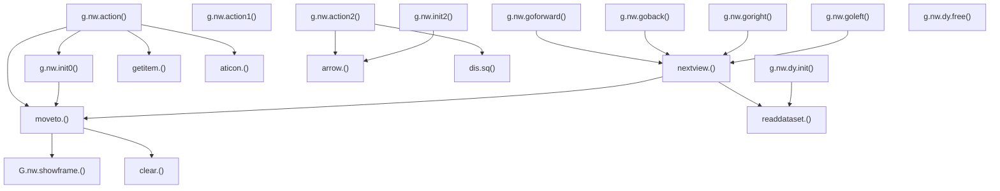

# BCPL Procedure Reference

All procedures are in `build/src/NW/walk1.b` and `build/src/NW/walk2.b`. The module compiles to a runnable file named `R.WALK`. Version 16 (UNI, September 1987) is the final version, splitting plan/arrow code into `walk2.b`.

---

## `walk1.b` Procedures

### Helper Functions

#### `r(d)`
```bcpl
let r(d) = g.ut.unpack16.signed(g.nw, d+d)
```
Reads a signed int16 from the dataset body at word offset `d` (byte offset `d×2`) relative to `g.nw`.

#### `ru(d)`
```bcpl
and ru(d) = g.ut.unpack16(g.nw, d+d)
```
Reads an unsigned uint16 at the same position. Used for `base_view+1` and `base_plan` header fields, and plan table coordinates.

---

### `clear.()`
Clears the message and/or display areas if they have been written to, then resets the dirty flags.

```bcpl
let clear.() be
$(  if g.nw!wmess do $(  g.sc.clear(m.sd.message); g.nw!wmess := false $)
    if g.nw!wdisp do $(  g.sc.clear(m.sd.display); g.nw!wdisp := false $)
$)
```

---

### `G.nw.showframe.(n)`
Displays LaserDisc frame `n` by calling the video hardware primitive. Deliberately does **not** unmute the audio (noted by a comment — audio unmute is handled separately in `g.nw.action()`).

```bcpl
and G.nw.showframe.(n) be
$(  g.vh.frame(n)
$)
```

---

### `ingallery.()`
Returns `true` if the system is currently in gallery mode. Checks the global state and, in ambiguous `m.st.detail` cases, uses the `g.nw!gallerydetail` flag.

```bcpl
and ingallery.() = valof
$(  let s = g.context!m.state
    if s = m.st.gallery | s = m.st.galmove |
       s = m.st.gplan1  | s = m.st.gplan2 |
       s = m.st.detail  & g.nw!gallerydetail resultis true
    resultis false
$)
```

---

### `deadend.(view)`
Returns `true` if there is no forward link from `view` (i.e. the control table `next_view` entry is zero).

```bcpl
and deadend.(view) = r(g.nw!ctable+2*view) = 0
```

---

### `nextview.(view)`
Returns the view reached by stepping forward from `view`. Handles same-dataset links (positive `next_view`) and cross-dataset links (negative `next_view`) by calling `readdataset.()` and loading the linked dataset.

Also updates `g.nw!base.pos` when crossing into a new dataset.

**Returns**: the next view number (0 if dead-end, which callers must check).

---

### `rightof.(view)`
Returns the view 45° clockwise from `view`. Wraps within the 8-view group.

```bcpl
and rightof.(view) = (view & 7) = 0 -> view-7, view+1
```

---

### `leftof.(view)`
Returns the view 45° counter-clockwise from `view`. Wraps within the 8-view group.

```bcpl
and leftof.(view) = (view & 7) = 1 -> view+7, view-1
```

---

### `opposite.(view)`
Returns the view 180° from `view`, implemented as four consecutive `leftof` calls.

```bcpl
and opposite.(view) = leftof.(leftof.(leftof.(leftof.(view))))
```

---

### `moveto.(nextview)`
The core movement operation. Updates the current view, sets the menu dirty flag, clears the screen, shows the frame, and draws detail icons (in walk mode only).

```
moveto(nextview):
  1. g.nw!view := nextview
  2. g.nw!fiddlemenu := true
  3. clear.()
  4. G.nw.showframe.(base_view + nextview)
  5. if syslev ≠ 1:
       read detail_offset from ctable
       if detail_offset ≥ 0:
         draw magnifying glass icons from dtable
```

---

### `readdataset.(o)`

Loads a dataset from disk. `o` is a two-word (32-bit) value containing the byte offset within the target file.

**File selection**:
- `ingallery.()` → `"GALLERY"`
- high word bit 15 set → `"DATA2"`
- otherwise → `"DATA1"`

**Steps**:
1. Open the appropriate file.
2. Strip the DATA2 flag bit from `o` to get the clean byte offset.
3. Save `o` (including flag) to `g.nw!addr0/addr1` for caching.
4. Read 60 bytes (header) into `g.nw`.
5. Calculate remaining bytes: `r(20) + r(25)*2 − 60`.
6. Assert remaining bytes fit in `m.datasize` (the only trap in WALK).
7. Read remaining bytes into `g.nw + 60/BYTESPERWORD`.
8. Close file.
9. Extract table word offsets: `ltable := r(14)/2`, `ctable := r(16)/2`, etc.
10. Set `base_view := r(27)−1`, `base_plan := r(28)`, `syslev := r(29)`.
11. Set `vrestore := true`.

---

### `g.nw.goright()`
Sidesteps right: `rightof×2 → nextview → leftof×2`. Calls `error.()` if the target is a dead-end.

---

### `g.nw.goleft()`
Sidesteps left: `leftof×2 → nextview → rightof×2`. Calls `error.()` if blocked.

---

### `error.()`
Displays the standard "No move possible in this direction" error message.

```bcpl
and error.() be g.sc.ermess("No move possible in this direction")
```

---

### `g.nw.goforward()`
Moves forward: `nextview(view) → moveto`. Calls `error.()` if dead-end.

---

### `g.nw.goback()`
Moves backward: `opposite → nextview → opposite → moveto`. Calls `error.()` if blocked.

---

### `g.nw.init0()`
First-entry initialisation for WALK. Two cases:

1. **Returning from a selected item** (`itemselected & ingallery()`): restore video, redraw current view.
2. **Fresh entry**: set view from ctable entry 0; if entering the gallery (not from `startstop`), play the intro film (`film.start` to `m.ov.nfilme`); draw the initial message bar.

---

### `g.nw.init()`
Re-entry initialisation (from detail or plan sub-states). Simply re-displays the current view.

```bcpl
and g.nw.init() be moveto.(g.nw!view)
```

---

### `aticon.(x, y)`
Tests whether the mouse pointer is within the hit area of an icon at position `(x, y)`.

- **Gallery mode**: rectangular hit zone, `m.picwidth × m.picheight` (64 × 64)
- **Walk mode**: circular hit zone, radius `m.lens.size` (45 graphics units)

```bcpl
and aticon.(x,y) = g.nw!m.syslev = 1 ->
    x <= g.xpoint <= x+m.picwidth & y <= g.ypoint <= y+m.picheight,
    abs(x-g.xpoint) <= m.lens.size & abs(y-g.ypoint) <= m.lens.size
```

---

### `getitem.(q, d)`
Reads a NAMES record at index `d` (word-indexed from `q`) and initiates a pending state change to that item.

**Steps**:
1. Open `NAMES`.
2. Seek to `d × 36` bytes.
3. Read 36-byte title entry.
4. Close file.
5. Copy title to `g.context!m.itemrecord`.
6. Unpack 32-bit address to `g.context!m.itemaddress`.
7. Map type byte to state: `g.key := -(type!table ...)`.
8. If type = photo (8): set `g.context!m.picture.no := 1`.
9. If type = essay (6/7): clear address2 and address3.
10. Set `g.context!m.itemselected := true`.

---

### `g.nw.action()`
Main event handler, called each cycle by the kernel dispatcher.

**Sequence**:
1. If `justselected` or returning from a selected gallery item: call `init0()`.
2. If just back from close-up (`cu > 0`): call `init()` and reset `cu`.
3. If `vrestore`: unmute video, clear flag.
4. If in move state and `fiddlemenu`: redraw menu bar, graying unavailable directions.
5. Translate TAB+mouse position to cursor keys.
6. `switchon g.key`:
   - Left/Right cursor: turn (`leftof`/`rightof`)
   - Up cursor: `goforward()`
   - Down cursor: `goback()`
   - Return: detect icon click, enter gallery item or walk close-up chain

---

### `g.nw.action1()`
Event handler for the close-up detail state (`m.st.detail` in walk mode).

- FKey7 (or left screen third via TAB): previous frame (`cu--`)
- FKey8 (or right screen third via TAB): next frame (`cu++`)
- Beeps at chain boundaries.
- Unmutes video if `vrestore` is set.

---

### `g.nw.dy.init()`
Dynamic initialisation — allocates the `g.nw` vector and loads the appropriate dataset.

```
1. GETVEC(m.h + m.datasize)
2. g.ut.restore(g.nw, m.h, m.io.nwcache)   // restore cached header slots
3. g.nw := g.nw + m.h                       // advance past header slots
4. if ingallery(): check for fresh-start states → set offset to 0
   else:           copy m.itemaddress from context
5. readdataset.(g.nw+addr0)
```

---

### `g.nw.dy.free()`
Dynamic cleanup — caches header slots and frees the vector.

```bcpl
and g.nw.dy.free() be
$(  g.nw := g.nw - m.h
    g.ut.cache(g.nw, m.h, m.io.nwcache)
    FREEVEC(g.nw)
$)
```

---

## `walk2.b` Procedures

This file was split out in version 16 (September 1987) to add plan functionality.

### Static Variables

```bcpl
static $( direction = ?; plan = ? $)
```

Module-level state for the plan display:
- `direction`: current compass direction (0–7) on the plan
- `plan`: current plan image number

---

### `arrow.(x, y, dir)`
Draws a directional arrow at plan coordinates `(x, y)` facing direction `dir` (0 = North, clockwise).

Uses integer-approximated trigonometry:
```bcpl
let cosa = dir ! table 10, 7, 0, -7,-10, -7, 0, 7
let sina = dir ! table  0, 7,10,  7,  0, -7,-10,-7
```

Draws:
- A rectangular shaft: `g.sc.parallel()`
- A triangular arrowhead: `g.sc.triangle()`

Sets `g.nw!wdisp := true` (display area has content).

---

### `g.nw.init2()`
Initialises the plan display. Computes position, plan number, and direction from the plan table, then shows the plan frame and draws the arrow.

**Key formula**:
```bcpl
position  := (g.nw!view - 1) / 8 * 2
plan      := ru(ptable + position) >> 12
direction := (8 - (ru(ptable + position + 1) >> 12) + g.nw!view) rem 8
plan_frame := g.nw!m.baseplan + g.nw!m.baseview + plan
```

---

### `g.nw.action2()`
Event handler for the plan view states.

**Change key** (rotate direction):
1. `direction := (direction + 1) rem 8`
2. Recalculate view from `base_direction + new_direction`
3. Update `g.nw!view`
4. Redraw arrow at same coordinates

**Action key** (click to navigate):
1. Find plan table entry closest to mouse click `(x, y)` on the current plan image using squared Euclidean distance
2. Apply avoidance rules (skip entries behind `base.pos`)
3. Compute new view from best position + current direction
4. Update `g.nw!view`
5. Redraw arrow

---

### `dis.sq(a, b, len.sq)`
Computes `a² + b²` in 32-bit integer arithmetic, storing the result in the `len.sq` two-word vector. Used by `g.nw.action2()` for distance comparisons.

```bcpl
and dis.sq(a, b, len.sq) be
$(  let A.SQ = vec 1; let B.SQ = vec 1
    if a < 0 a := -a;  if b < 0 b := -b
    G.ut.set32(a, 0, A.SQ); G.ut.mul32(A.SQ, A.SQ)
    G.ut.set32(b, 0, B.SQ); G.ut.mul32(B.SQ, B.SQ)
    G.ut.add32(B.SQ, A.SQ)
    G.ut.mov32(A.SQ, len.sq)
$)
```

---

## Call Graph


