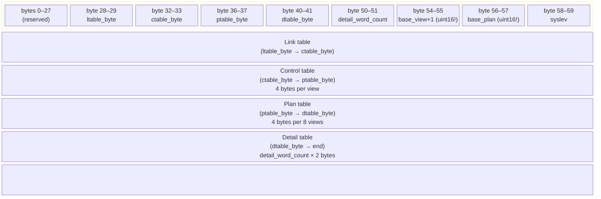

# Dataset Header

Every dataset — whether the main gallery or a walk sub-dataset embedded in GALLERY, or a dataset in DATA1/DATA2 — begins with a **60-byte header**. All fields are **little-endian int16** (signed 16-bit), with two critical exceptions that must be read as **unsigned** (noted below).

## Header Field Map

| Byte Offset | Words | BCPL `r(n)` | Field | Type | Notes |
|-------------|-------|-------------|-------|------|-------|
| 0–27 | 0–13 | r(0)–r(13) | *(reserved)* | — | Unused / system fields |
| 28–29 | 14 | r(14) | `ltable_byte` | int16 | Byte offset of link table; divide by 2 for word index |
| 30–31 | 15 | r(15) | *(reserved)* | int16 | — |
| 32–33 | 16 | r(16) | `ctable_byte` | int16 | Byte offset of control table |
| 34–35 | 17 | r(17) | *(reserved)* | int16 | — |
| 36–37 | 18 | r(18) | `ptable_byte` | int16 | Byte offset of plan table |
| 38–39 | 19 | r(19) | *(reserved)* | int16 | — |
| 40–41 | 20 | r(20) | `dtable_byte` | int16 | Byte offset of detail table |
| 42–49 | 21–24 | — | *(reserved)* | — | — |
| 50–51 | 25 | r(25) | `detail_word_count` | int16 | Number of 16-bit words in detail table |
| 52–53 | 26 | r(26) | *(reserved)* | int16 | — |
| 54–55 | 27 | r(27) | `base_view + 1` | **uint16** | LaserDisc frame offset for views; read unsigned, subtract 1 |
| 56–57 | 28 | r(28) | `base_plan` | **uint16** | LaserDisc frame offset for plan images; read unsigned |
| 58–59 | 29 | r(29) | `syslev` | int16 | `1` = gallery mode, anything else = walk mode |

> **Warning**: Fields at offsets 54 and 56 (`base_view+1` and `base_plan`) **must** be read as unsigned 16-bit integers. Sub-datasets have values exceeding 32,767 (e.g. BRECON's `base_view` is well above 32,767), which would be negative if read as signed.

## BCPL Extraction Code

From `walk1.b`, `readdataset.()`:

```bcpl
g.dh.read(p, v, g.nw, 60)       // read 60-byte header into g.nw
g.nw!ltable   := r(14)/2        // byte→word: link table word offset
g.nw!ctable   := r(16)/2        // byte→word: control table word offset
g.nw!ptable   := r(18)/2        // byte→word: plan table word offset
g.nw!dtable   := r(20)/2        // byte→word: detail table word offset
g.nw!m.baseview := r(27)-1      // unsigned read; subtract 1 to get base_view
g.nw!m.baseplan := r(28)        // unsigned read; plan base frame
g.nw!m.syslev   := r(29)        // 1 = gallery, else walk
```

The helper `r(n)` calls `g.ut.unpack16.signed(g.nw, n+n)` (signed), while `ru(n)` calls `g.ut.unpack16(g.nw, n+n)` (unsigned). For offsets 27 and 28 the BCPL code stores these as signed but the Python parser must read them unsigned.

## Total Dataset Size

```
total_bytes = dtable_byte + detail_word_count × 2
```

The WALK code reads the header first, then calculates the remaining bytes to read:

```bcpl
let len = r(20) + r(25)*2 - 60   // bytes after the 60-byte header
```

## Memory Map (diagram)



## Verified Values for the Main GALLERY Dataset

| Field | Value |
|-------|-------|
| `ltable_byte` | 60 |
| `ctable_byte` | 120 |
| `ptable_byte` | 1,404 |
| `dtable_byte` | 1,564 |
| `base_view` | 802 (stored as 803 unsigned) |
| `base_plan` | 321 |
| `syslev` | 1 (gallery) |
| `initial_view` | 1 (from ctable entry 0) |
| View count | 320 (`(ptable_byte − ctable_byte) / 4`) |
