# The `g.nw` Runtime Vector

`g.nw` is a BCPL global pointer to a dynamically-allocated vector that holds all runtime state for the WALK module. It is the central data structure used by both `walk1.b` and `walk2.b`.

The vector is allocated by `g.nw.dy.init()` as:
```bcpl
g.nw := GETVEC(m.h + m.datasize)   // allocate header slots + data body
g.nw := g.nw + m.h                 // advance pointer so slots are at negative indices
```

This means the **header slots** live at negative indices (`g.nw!-1` through `g.nw!-18`) and the **dataset body** (tables) lives at non-negative word offsets from `g.nw`.

## Memory Layout

```mermaid
block-beta
    columns 1
    block:header["Header slots (m.h = 18 words, at negative indices)"]
        H1["g.nw!base.pos  [-18]  position on entry to new walk"]
        H2["g.nw!addr0     [-16]  low word of current dataset byte offset"]
        H3["g.nw!addr1     [-15]  high word of current dataset byte offset"]
        H4["g.nw!gallerydetail [-17]  true if detail came from gallery"]
        H5["g.nw!m.syslev  [-14]  1 = gallery mode"]
        H6["g.nw!m.baseplan [-13]  first frame of plan images"]
        H7["g.nw!m.baseview [-12]  first frame of view images"]
        H8["g.nw!dtable    [-11]  detail table word offset"]
        H9["g.nw!ptable    [-10]  plan table word offset"]
        H10["g.nw!ctable   [-9]   control table word offset"]
        H11["g.nw!ltable   [-8]   link table word offset"]
        H12["g.nw!vrestore [-7]   video needs unmuting after I/O"]
        H13["g.nw!wdisp    [-6]   display area has been written"]
        H14["g.nw!wmess    [-5]   message area has been written"]
        H15["g.nw!fiddlemenu [-4] menu bar needs redrawing"]
        H16["g.nw!cu       [-3]   close-up chain pointer (0 = not in close-up)"]
        H17["g.nw!cubase   [-2]   base of close-up chain in dtable"]
        H18["g.nw!view     [-1]   current view number (1-based)"]
    end
    body["Dataset body (m.datasize words, at non-negative offsets)\nContains ltable, ctable, ptable, dtable data\nfollowed by detail data\n(up to 13000/BYTESPERWORD words)"]

    header --> body
```



## Header Slot Reference

All slots are defined in `nwhd.h` as negative manifest constants.

| Constant | Index | Type | Description |
|----------|-------|------|-------------|
| `view` | −1 | int | Current view number (1-based) within the active dataset |
| `cubase` | −2 | int | Word offset into dtable of the active close-up chain base |
| `cu` | −3 | int | Index into the close-up chain; 0 = not in close-up |
| `fiddlemenu` | −4 | bool | True after navigation — menu bar needs redrawing |
| `wmess` | −5 | bool | True if message area contains drawn content |
| `wdisp` | −6 | bool | True if display area contains drawn content |
| `vrestore` | −7 | bool | True if video needs unmuting (set after any file I/O) |
| `ltable` | −8 | int | Word offset from `g.nw` base to link table |
| `ctable` | −9 | int | Word offset from `g.nw` base to control table |
| `ptable` | −10 | int | Word offset from `g.nw` base to plan table |
| `dtable` | −11 | int | Word offset from `g.nw` base to detail table |
| `m.baseview` | −12 | int | LaserDisc frame number of view 0 (= base_view from header) |
| `m.baseplan` | −13 | int | LaserDisc frame number of plan 0 |
| `m.syslev` | −14 | int | 1 = gallery mode; anything else = walk mode |
| `addr1` | −15 | int | High 16 bits of the current dataset byte address |
| `addr0` | −16 | int | Low 16 bits of the current dataset byte address |
| `gallerydetail` | −17 | bool | True if the current detail state was entered from gallery |
| `base.pos` | −18 | int | Plan table word position on entry to the current walk |

## Key Invariants

- `g.nw!view` is always 1-based and valid within the current dataset's ctable.
- `g.nw!m.baseview + g.nw!view` gives the absolute LaserDisc frame to display.
- `g.nw!vrestore` is set to `true` by `readdataset.()` and cleared once the video is unmuted in `g.nw.action()`.
- `g.nw!cu = 0` means the user is not in a close-up chain. Values 1..n index frames within the chain headed at `g.nw!cubase`.

## Caching

The header slots (18 words) are saved to/from a persistent cache (`m.io.nwcache`) across state transitions. This preserves the current view and navigation state when the user temporarily leaves WALK (e.g. to view a detail item):

```bcpl
// On exit:
g.nw := g.nw - m.h
g.ut.cache(g.nw, m.h, m.io.nwcache)
FREEVEC(g.nw)

// On re-entry:
g.nw := GETVEC(m.h + m.datasize)
g.ut.restore(g.nw, m.h, m.io.nwcache)
g.nw := g.nw + m.h
```

## Table Accessor Pattern

All table accesses in BCPL use the word-offset fields to index into the dataset body. The helper `r(n)` reads a signed int16 at byte offset `n×2` from the start of `g.nw`:

```bcpl
let r(d) = g.ut.unpack16.signed(g.nw, d+d)
let ru(d) = g.ut.unpack16(g.nw, d+d)   // unsigned variant

// Example: read next_view for current view:
r(g.nw!ctable + 2*g.nw!view)

// Example: read plan table x_word for current view:
ru(g.nw!ptable + (g.nw!view-1)/8*2 + 1)
```
