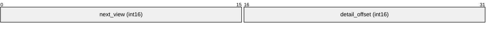
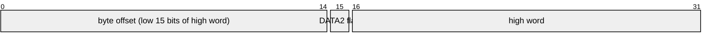
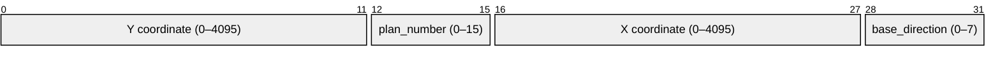
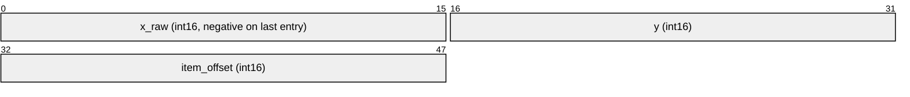
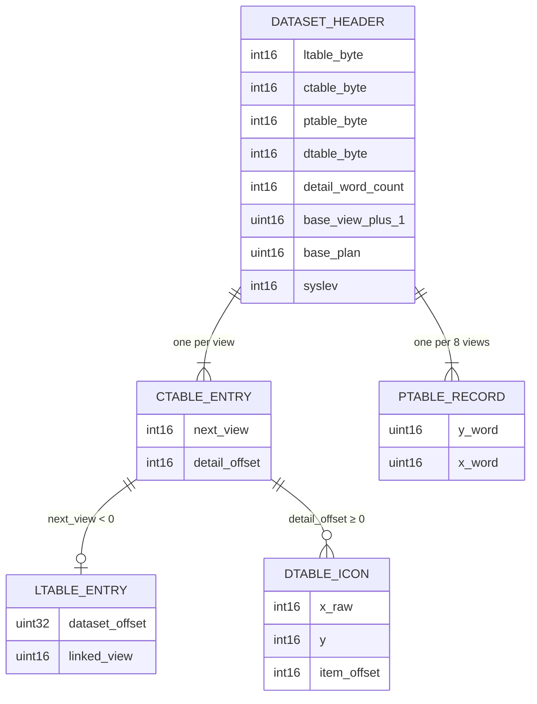

# Dataset Tables

After the 60-byte header, each dataset contains four packed binary tables in sequence. Their byte offsets are stored in the header. All integer values are little-endian.

```
Dataset binary layout:
[  60 bytes  ][  ltable  ][    ctable    ][   ptable   ][       dtable       ]
0             60          ctable_byte     ptable_byte    dtable_byte          end
```

---

## Control Table (ctable)

**Offset**: `ctable_byte` from dataset start
**Record size**: 4 bytes per entry (2 × int16)
**Count**: `n_views = (ptable_byte − ctable_byte) / 4`

The control table has one entry per view, plus a special entry 0.

### Entry Format

| Word | Bytes | Field | Notes |
|------|-------|-------|-------|
| 0 | 0–1 | `next_view` | int16: forward navigation result |
| 1 | 2–3 | `detail_offset` | int16: offset into dtable; −1 = no details |



### `next_view` Semantics

| Value | Meaning |
|-------|---------|
| `0` | Dead-end — no forward movement possible |
| `> 0` | View number to navigate to in the same dataset |
| `< 0` | Cross-dataset link; `k = −next_view` indexes the link table |

### Entry 0 (Special)

`ctable[0].next_view` stores the **initial view number** for the dataset (not a real navigation link). This is the first view shown when the dataset is entered.

```bcpl
g.nw!view := r(g.nw!ctable)   // read initial view from entry 0
```

### Byte Addressing

View `v` (1-based): `ctable_base + 4*v` bytes from dataset start:
```bcpl
r(g.nw!ctable + 2*view)        // next_view for view
r(g.nw!ctable + 2*view + 1)    // detail_offset for view
```
(BCPL `r(n)` reads int16 at byte offset `n×2` from dataset base.)

---

## Link Table (ltable)

**Offset**: `ltable_byte` from dataset start
**Record size**: variable (accessed by index `k`)

The link table is referenced only when `ctable[v].next_view < 0`. The negative value negated gives the index `k` into the link table.

### Reading a Link Record

```bcpl
k := -r(g.nw!ctable + 2*view)          // k = positive index
g.ut.unpack32(g.nw, (g.nw!ltable-k)*2, v) // 32-bit byte offset to linked dataset
linked_view := r(g.nw!ltable - k + 2)  // view to enter in that dataset
```

### Link Record Layout (at index k, negative indexing)

| Words from ltable | Bytes | Field | Notes |
|-------------------|-------|-------|-------|
| −k, −k+1 | 4 bytes | `dataset_offset` | uint32 LE: byte offset in target file |
| −k+2 | 2 bytes | `linked_view` | uint16: entry view in linked dataset |

### Target File Selection

The high word of `dataset_offset` encodes the target file:



| Bit 15 of high word | File |
|--------------------|------|
| `0` (and `ingallery()`) | GALLERY |
| `0` (and not `ingallery()`) | DATA1 |
| `1` | DATA2 |

For gallery-to-walk transitions, all link targets point within the GALLERY file (high word = 0, `ingallery()` = true).

---

## Plan Table (ptable)

**Offset**: `ptable_byte` from dataset start
**Record size**: 4 bytes (2 × uint16) per group of 8 views

Views are organised in groups of 8, each group sharing the same physical location on the plan map. The plan table has one 4-byte record per group.

### Position Index

For a view `v` (1-based):
```
position = ((v − 1) / 8) × 2     (integer division)
```

### Record Layout

| Word | Bytes | Field | Bits 12–15 | Bits 0–11 |
|------|-------|-------|------------|-----------|
| `ptable[position]` | 2 | y_word | `plan_number` | `Y` coordinate |
| `ptable[position+1]` | 2 | x_word | `base_direction` | `X` coordinate |



### Field Semantics

| Field | Range | Meaning |
|-------|-------|---------|
| `X`, `Y` | 0–4095 | Position of the location marker on the plan image |
| `plan_number` | 0–15 | Which plan image to display (`base_plan + base_view + plan_number`) |
| `base_direction` | 0–7 | Compass direction of view 1 within this group |

### Direction Calculation

The compass direction for view `v` on the plan is:
```
direction = (8 − base_direction + v) mod 8
angle = direction × 45°
```

From `walk2.b`, `g.nw.init2()`:
```bcpl
let x = ru(g.nw!ptable + position + 1)
let y = ru(g.nw!ptable + position)
plan      := y >> 12                            // bits 12–15 of y_word
direction := (8 - (x >> 12) + g.nw!view) rem 8 // direction formula
```

### Plan Frame Number

```
plan_frame = base_plan + base_view + plan_number
```

---

## Detail Table (dtable)

**Offset**: `dtable_byte` from dataset start
**Record size**: variable (6 bytes per icon entry, terminated by negative x)

The detail table stores the screen positions and item references for interactive icons (magnifying glass icons in walk mode, gallery pictures in gallery mode). Each view's icon list is located via the `detail_offset` in the control table.

### Icon Entry Layout

Each icon entry is 3 × int16 (6 bytes):

| Word | Bytes | Field | Notes |
|------|-------|-------|-------|
| 0 | 0–1 | `x_raw` | int16: `abs(x_raw)` = screen X; **negative on last entry** |
| 1 | 2–3 | `y` | int16: screen Y coordinate |
| 2 | 4–5 | `item_offset` | int16: reference to item (gallery) or close-up (walk) |



### Termination

The list for a view ends when `x_raw < 0`. The actual X position is `abs(x_raw)`, so the last entry is still drawn — it just signals the end of the list.

```bcpl
$(  g.sc.movea(m.sd.display, abs(r(o)), r(o+1))
    g.sc.icon(m.sd.mag.glass, m.sd.plot)
    if r(o) < 0 break    // last entry — terminate after drawing
    o := o+3             // advance to next entry
$) repeat
```

### `item_offset` Semantics by Mode

**Gallery mode** (`syslev = 1`):
- `item_offset` is a word offset into the dtable itself.
- The NAMES record index is stored at `dtable + item_offset`.
- `getitem.(g.nw, g.nw!dtable + r(o+2))` reads the NAMES record.

**Walk mode** (`syslev ≠ 1`):
- `item_offset` points to a **close-up chain** in the dtable.
- Entry 0 of the chain: count of close-up frames.
- Entries 1..n: frame offsets from `base_view` to close-up frames.

### No-detail Sentinel

If `ctable[v].detail_offset = −1`, the view has no detail icons and the dtable is not accessed for that view.

---

## Table Relationships


