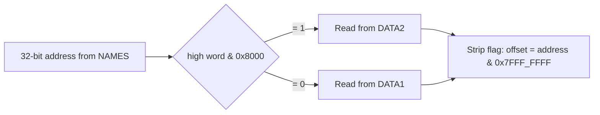
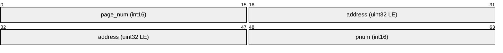
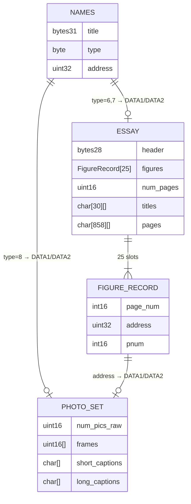

# DATA1 and DATA2 File Formats

`DATA1` and `DATA2` store the content payload items referenced by the NAMES file: national photo sets (type 8) and national essays (types 6 and 7). Which file to read is determined by bit 15 of the high word of the 32-bit address stored in each NAMES record.

## File Selection



## National Photo Set (Type 8)

Source: `nphd.h`, `parser.py:parse_photo_set()`

### Structure

```
┌─────────────────────────────────────────┐
│ Header / padding        (28 bytes)       │
├─────────────────────────────────────────┤
│ num_pics_raw            (2 bytes, uint16)│
│   bit 15: 1 = 8-line long captions      │
│   bits 0–14: number of pictures (n)     │
├─────────────────────────────────────────┤
│ Frame numbers           (2n bytes)       │
│   uint16 × n, little-endian             │
├─────────────────────────────────────────┤
│ Short captions          (30n bytes)      │
│   30 chars each (m.np.sclength = 30)    │
├─────────────────────────────────────────┤
│ Long captions           (lcs × n bytes) │
│   4 or 8 lines × 39 chars/line          │
│   lcs = 156 (4 lines) or 312 (8 lines) │
└─────────────────────────────────────────┘
```

### Field Details

| Field | Offset | Size | Notes |
|-------|--------|------|-------|
| Header padding | 0 | 28 bytes | `m.np.num.pics.off = 28` |
| num_pics_raw | 28 | 2 bytes | uint16 little-endian |
| Frame numbers | 30 | 2 × n bytes | Absolute LaserDisc frame numbers |
| Short captions | 30 + 2n | 30 × n bytes | `m.np.sclength = 30` |
| Long captions | 30 + 32n | lcs × n bytes | `m.np.lclength = 39` chars/line |

**Long caption size selection** (from `num_pics_raw` bit 15):
- Bit 15 = `1` → `m.np.large.lc = 8` lines → 312 bytes per photo
- Bit 15 = `0` → `m.np.small.lc = 4` lines → 156 bytes per photo


### Caption Buffer Sizes

| Constant | Value | Meaning |
|----------|-------|---------|
| `m.np.sclength` | 30 | Characters per short caption |
| `m.np.lclength` | 39 | Characters per long caption line |
| `m.np.small.lc` | 4 | Lines per long caption (small) |
| `m.np.large.lc` | 8 | Lines per long caption (large) |
| `m.np.max.shorts` | 100 | Maximum short captions that can be buffered |

---

## National Essay (Types 6 and 7)

Source: `nehd.h`, `parser.py:parse_essay()`

Type 6 (`m.ne.nessay`) is a text-only essay; type 7 (`m.ne.picessay`) is an essay with embedded picture references.

### Structure

```
┌──────────────────────────────────────────────────────────┐
│ Header / padding             (28 bytes)                   │
│   m.ne.dataset.header.size = 28                          │
├──────────────────────────────────────────────────────────┤
│ Figure records               (200 bytes total)           │
│   25 records × 8 bytes each                              │
│   m.ne.phosize = 25, m.ne.rsize = 8                     │
├──────────────────────────────────────────────────────────┤
│ num_pages                    (2 bytes, uint16 LE)        │
│   m.ne.page.no.offset = 228                              │
├──────────────────────────────────────────────────────────┤
│ Page titles                  (30 × (num_pages + 1) bytes)│
│   m.ne.article.title.offset = 230                       │
│   m.ne.title.size = 30 bytes each                       │
├──────────────────────────────────────────────────────────┤
│ Text pages                   (858 × num_pages bytes)     │
│   22 lines × 39 chars = 858 bytes per page              │
│   m.ne.nolines = 22, m.sd.linelength = 39               │
└──────────────────────────────────────────────────────────┘
```

### Figure Record Layout (8 bytes each)

Each of the 25 figure slots describes an optional embedded image or photo set:

| Bytes | Field | Notes |
|-------|-------|-------|
| 0–1 | `page_num` | int16: which text page this figure appears on |
| 2–5 | `address` | uint32 LE: DATA1/DATA2 address of the photo set |
| 6–7 | `pnum` | int16: which photo within that set to show; use 1 if ≤ 0 |



### Page Text Layout

Each text page is exactly 858 bytes (`m.sd.pagelength = 858 = 22 × 39`):
- 22 lines (`m.ne.nolines = 22`)
- 39 characters per line (`m.sd.linelength = 39`)
- Byte 0 bit 7: monospaced rendering flag when set

The page title for page `p` (1-based) is at:
```
offset = m.ne.article.title.offset + p × m.ne.title.size
```

Title entry 0 (before page 1) holds the essay's overall title.

### Essay Type Constants (nehd.h)

| Constant | Value | Meaning |
|----------|-------|---------|
| `m.ne.nessay` | 6 | Text essay (type field in NAMES) |
| `m.ne.picessay` | 7 | Picture essay (type field in NAMES) |
| `m.ne.dataset.header.size` | 28 | Bytes before figure data |
| `m.ne.photo.data.size` | 200 | Bytes of figure records (25 × 8) |
| `m.ne.page.no.offset` | 228 | Byte offset to num_pages field |
| `m.ne.article.title.offset` | 230 | Byte offset to first title |
| `m.ne.title.size` | 30 | Bytes per title entry |
| `m.ne.phosize` | 25 | Max figure records |
| `m.ne.rsize` | 8 | Bytes per figure record |
| `m.ne.nolines` | 22 | Text lines per page |
| `m.ne.lcaplen` | 39 | Chars per long-caption line |
| `m.ne.scaplen` | 30 | Chars per short caption |
| `m.ne.capsize1` | 8 | Lines in a long long-caption |
| `m.ne.capsize2` | 4 | Lines in a shorter long-caption |

---

## Relationship Between File Types


