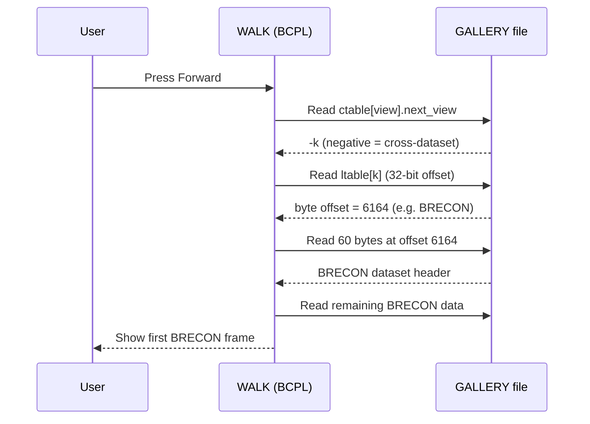
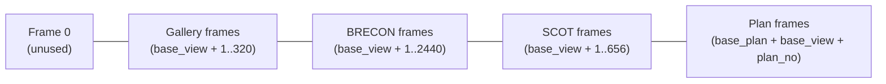

# GALLERY File Format

The `GALLERY` file is the primary binary data file on the BBC Domesday National disc VFS. It is 54,716 bytes long and contains ten independent datasets packed end-to-end: the main gallery dataset starting at byte 0, followed by nine walk sub-datasets at fixed offsets.

## File Layout

```mermaid
block-beta
    columns 1
    block:gallery["GALLERY (54,716 bytes)"]
        a["Gallery dataset\nbytes 0 – 6,163"]
        b["BRECON\nbytes 6,164 – 18,449"]
        c["SCOT\nbytes 18,450 – 22,473"]
        d["URBAN\nbytes 22,474 – 31,273"]
        e["FARM\nbytes 31,274 – 40,399"]
        f["FLAT\nbytes 40,400 – 42,673"]
        g["STONE\nbytes 42,674 – 46,383"]
        h["STOCK\nbytes 46,384 – 51,419"]
        i["TERACE\nbytes 51,420 – 53,595"]
        j["SHOW\nbytes 53,596 – 54,715"]
    end
```



## Walk Sub-dataset Offsets

Each walk is a complete, self-contained dataset (see [Dataset Header](../data-structures/dataset-header.md)). The offsets below are the byte positions within the GALLERY file where each walk's 60-byte header begins.

| Name   | Byte Offset | Gallery View | Node Count |
|--------|-------------|--------------|------------|
| BRECON | 6,164       | 72           | 2,440      |
| SCOT   | 18,450      | 92           | 656        |
| URBAN  | 22,474      | 104          | 1,744      |
| FARM   | 31,274      | 124          | 1,672      |
| FLAT   | 40,400      | 273          | 304        |
| STONE  | 42,674      | 283          | 336        |
| STOCK  | 46,384      | 289          | 560        |
| TERACE | 51,420      | 299          | 232        |
| SHOW   | 53,596      | 306          | 232        |

- **Gallery View**: The view number in the gallery dataset that contains the clickable icon linking to this walk.
- **Node Count**: Total number of 360° positions (each comprising 8 directional views) × 8.

## How Cross-Dataset Links Work

The gallery dataset at offset 0 contains cross-dataset links in its control table. When a view's `next_view` field is negative (e.g. `–k`), the link table at index `k` holds the byte offset into the GALLERY file where the sub-dataset begins.



## Total Dataset Size Formula

Each embedded dataset's byte length can be computed from its header:

```
total_bytes = dtable_byte + detail_word_count × 2
```

where `dtable_byte` (header offset 40) and `detail_word_count` (header offset 50) are read from the 60-byte header. See [Dataset Header](../data-structures/dataset-header.md) for field definitions.

## Frame Number Space

All frame numbers on the National disc share a single flat address space. The gallery and each walk use non-overlapping ranges defined by their `base_view` header field.



Gallery and walk frame ranges do not overlap because each dataset has a different `base_view` value. Plan images for a dataset share the same `base_view` as their views, offset by `base_plan`.
