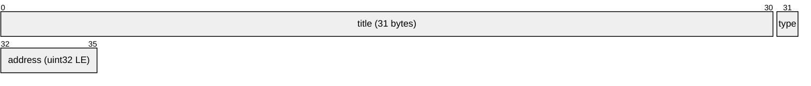
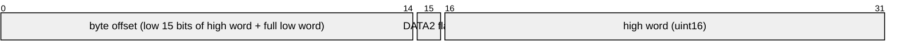

# NAMES File Format

The `NAMES` file is a flat array of fixed-size records, one per gallery item. Each record is **36 bytes** (`m.titlesize = 36` from `nwhd.h`) and contains the item's display title, type code, and the 32-bit address of its data within DATA1 or DATA2.

## Record Layout

| Byte Range | Size | Field | Notes |
|------------|------|-------|-------|
| 0–30       | 31 bytes | `title` | Display text, space/null padded |
| 31         | 1 byte   | `type` | Item type code (0–10) |
| 32–35      | 4 bytes  | `address` | 32-bit little-endian data address |



## Item Type Codes

| Type | Constant | Content |
|------|----------|---------|
| 0    | —        | Invalid / unused |
| 1    | —        | Mappable data (area map) |
| 2    | —        | Mappable data (area map) |
| 3    | —        | Mappable data (area map) |
| 4    | `m.st.chart` | National chart |
| 5    | —        | Unused |
| 6    | `m.ne.nessay` | National essay (text only) |
| 7    | `m.ne.picessay` | National essay (with pictures) |
| 8    | `m.st.nphoto` | National photo set |
| 9    | `m.st.walk` | Surrogate walk (links to walk dataset) |
| 10   | `m.st.film` | Film sequence |

The type determines which system state the user is taken to when the item is selected. This mapping is implemented in `getitem.()` in `walk1.b`:

```
type!table 0, m.st.datmap, m.st.datmap, m.st.datmap,
              m.st.chart, 0, m.st.ntext, m.st.ntext,
              m.st.nphoto, m.st.walk, m.st.film
```

## Address Encoding

The 32-bit `address` field encodes both the target file and the byte offset within it:



| Bit | Meaning |
|-----|---------|
| Bit 31 (high word bit 15) | `1` = read from DATA2, `0` = read from DATA1 |
| Bits 30–0 | Byte offset within the target file |

In BCPL (`readdataset.` procedure):
```
high & #X8000 → "DATA2", "DATA1"
g.ut.set32(low, high & #X7FFF, v)   // strip flag to get clean offset
```

## Reading a NAMES Record

1. Open the `NAMES` file.
2. Seek to `record_index × 36` bytes from the start.
3. Read 36 bytes.
4. Parse `title` (bytes 0–30), `type` (byte 31), `address` (bytes 32–35 little-endian uint32).

In `getitem.()`:
```bcpl
g.ut.set32(m.titlesize, 0, v)
g.ut.mul32(a, v)          // v = record_index * 36
g.dh.read(p, v, t, m.titlesize)
```

## Record Count

The total number of records can be found by dividing the NAMES file size by 36. Individual records are referenced by zero-based index.
