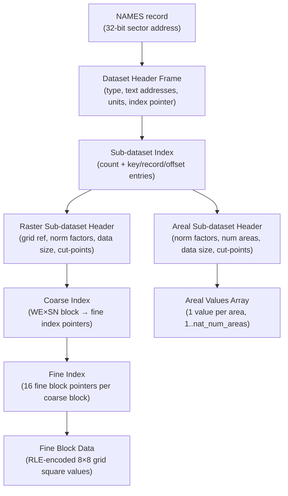
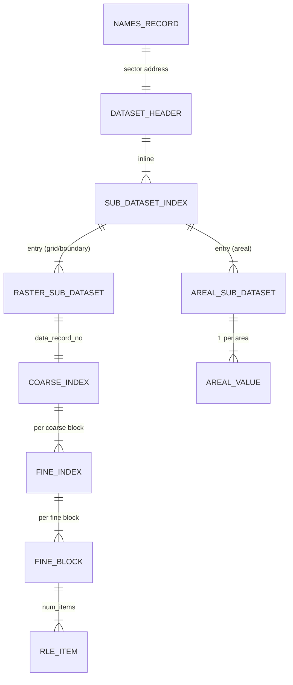

# NM Dataset Binary Format

The National Mappable (NM) module stores statistical data on the LaserDisc as a hierarchy of binary structures accessed through a frame-based I/O model. This document describes the on-disc layout derived from `build/src/NM/load1.b`, `load2.b`, `unpack.b`, `subsets.b`, and `frame.b`.

---

## Frame / Sector Model

All NM data is addressed via **frames**. A frame is the basic unit of disc I/O:

| Constant | Value | Meaning |
|----------|-------|---------|
| `m.dh.bytes.per.sector` | 256 | Bytes per sector |
| `m.dh.sectors.per.frame` | 24 | Sectors per frame |
| `m.dh.bytes.per.frame` | 6,144 | Bytes per frame (= `m.nm.frame.size` in words) |

The dataset header in the NAMES record stores a **32-bit absolute sector number**. The loader converts this to a frame number and byte offset:

```
frame_number = sector_number / 24       (integer quotient)
byte_offset  = (sector_number % 24) * 256
```

Data can span frames. The `g.nm.inc.frame.ptr` primitive automatically reads the next frame when the byte pointer reaches 6,144.

---

## Overall Structure

Each NM dataset is a multi-level hierarchy on disc:



---

## 1. Dataset Header

Located at the frame/offset derived from the NAMES record sector address.

All fields are read sequentially; the pointer auto-advances through frames.

| Bytes | Field | Notes |
|-------|-------|-------|
| 0 | _(padding)_ | Not used |
| 1 | `dataset_type` | `1`=grid mappable, `2`=areal boundary, `3`=areal mappable |
| 2–5 | `private_text_address` | 32-bit item address (see NAMES format) |
| 6–9 | `descriptive_text_address` | 32-bit item address |
| 10–13 | `technical_text_address` | 32-bit item address |
| 14–53 | _(skip 40 bytes)_ | 10 × 4-byte thesaurus term pointers |
| 54–57 | _(skip 4 bytes)_ | 4-byte item names file pointer |
| 58–97 | _(skip 40 bytes)_ | Title string (40 bytes; item name used instead) |
| 98–137 | `primary_units_string` | 40 bytes: abbreviation char + 39-char units label |
| 138–177 | `secondary_units_string` | 40 bytes: same layout |
| 178–179 | `value_data_type` / `raster_data_type` | uint16; meaning depends on dataset type (see below) |
| 180+ | Sub-dataset index | Starts here inline in the frame stream |

> **Note on units strings**: The first byte of each units string is an abbreviation character that is replaced with a space by the loader. The resulting BCPL string is 40 bytes (length byte = 40, then 39 visible chars).

### `dataset_type` values

| Value | Constant | Meaning |
|-------|----------|---------|
| 1 | `m.nm.grid.mappable.data` | Regular grid squares |
| 2 | `m.nm.areal.boundary.data` | Administrative boundary polygons (raster only) |
| 3 | `m.nm.areal.mappable.data` | Values per administrative area |

For `areal.boundary.data`, the 178–179 field is the `raster_data_type`; the actual value data type comes from the associated areal mappable dataset.

---

## 2. Sub-dataset Index

Immediately follows the dataset header in the frame stream. There are two indexes for some datasets (one for raster/boundary data, one for areal values), sharing the same structure.

### Index Layout

```
uint16  num_subsets          // count of entries (N)
// Repeated N times:
int16   key                  // sub-dataset key (e.g. year, date code)
uint16  relative_record_no   // record offset from dataset base frame
int16   word_offset          // position within that frame (×2 = byte offset)
```

- **Entry size**: 6 bytes (3 × uint16/int16)
- The `relative_record_no` is added to `g.nm.s!m.nm.dataset.record.number` to get the absolute frame number

---

## 3a. Raster Sub-dataset Header

Used for `grid.mappable.data` and `areal.boundary.data` datasets. Located at the position given by the sub-dataset index entry.

| Bytes | Field | Type | Notes |
|-------|-------|------|-------|
| 0–1 | `data_record_no` | uint16 | Relative frame number of coarse index |
| 2–3 | `data_word_offset` | int16 | Word offset within frame (×2 = byte offset) |
| 4–5 | `gr_start_e` | uint16 | Grid square easting start |
| 6–7 | `gr_start_n` | uint16 | Grid square northing start |
| 8–9 | `gr_end_e` | uint16 | Grid square easting end |
| 10–11 | `gr_end_n` | uint16 | Grid square northing end |
| 12–13 | `primary_norm_factor` | int16 | Normalisation factor (grid data only) |
| 14–15 | `secondary_norm_factor` | int16 | Secondary normalisation factor |
| 16 | `data_size` | byte | Bytes per value: 1, 2, 3 (variable), or 4 |
| 17 | `num_default_ranges` | byte | Count of pre-supplied class intervals (0–4) |
| 18 + | `default_ranges` | 4×N bytes | `num_default_ranges` × 4-byte cut-point values |
| … | `summary_data` | variable | See §5 below |
| … | Coarse index | inline | `data_record_no` points here |

---

## 3b. Areal Sub-dataset Header

Used for `areal.mappable.data` datasets.

| Bytes | Field | Type | Notes |
|-------|-------|------|-------|
| 0–1 | `data_record_no` | uint16 | Relative frame number of areal values |
| 2–3 | `data_word_offset` | int16 | Word offset within frame (×2 = byte offset) |
| 4–5 | `primary_norm_factor` | int16 | |
| 6–7 | `secondary_norm_factor` | int16 | |
| 8–9 | `nat_num_areas` | uint16 | Total number of areas in the values array |
| 10–11 | _(skip 2 bytes)_ | — | |
| 12 | `data_size` | byte | Bytes per value: 1, 2, or 4 |
| 13 | `num_default_ranges` | byte | |
| 14 + | `default_ranges` | 4×N bytes | |
| … | `summary_data` | variable | See §5 below |
| … | Areal values | inline | `data_record_no` points here |

---

## 4. Value Data Types

The `value_data_type` field (byte 178–179 of the dataset header) controls how values are interpreted:

| Constant | Value | Meaning |
|----------|-------|---------|
| `m.nm.absolute.type` | 0 | Raw counts |
| `m.nm.ratio.and.numerator.type` | 1 | Ratio + numerator (dual value) |
| `m.nm.percentage.and.numerator.type` | 4 | Percentage + numerator (dual value) |
| `m.nm.incidence.type` | 5 | Rate per population |
| `m.nm.categorised.type` | 6 | Category codes |

**Dual value types** (1 and 4) store two values per item: a ratio/percentage and its numerator. When loading, only the primary (ratio) value is used for display; the numerator is available for retrieval.

Missing data is encoded as `0x8000` (`m.nm.uniform.missing`). Area index 0 is always set to missing.

---

## 5. Summary Data

Follows the default ranges in both raster and areal sub-dataset headers.

| Bytes | Field | Notes |
|-------|-------|-------|
| 0–11 | _(skip 12 bytes)_ | National min, max, average (3 × 4-byte values; discarded) |
| 12+ | Equal interval sets | 3 sets; each preceded by uint16 count of cut-points |
| … | `num_nested_means` | uint16; valid range 1–3 |
| … | Nested means cut-points | `num_nested_means` × 4-byte values |
| … | Quantile sets | 3 sets; each preceded by uint16 count |
| … | `num_chi_squared` | uint16 |
| … | Chi-squared intervals | `num_chi_squared` × 4 bytes (discarded) |

Each **cut-point set** has the structure:
```
uint16  count_of_cut_points     // = m.nm.num.of.class.intervals = 5
// Repeated count times:
uint32  cut_point_value         // 32-bit class boundary value
```

Three sets of equal intervals and three sets of quantile cut-points are stored. The loader selects the set whose count matches `g.nm.s!m.nm.num.auto.cut.points`.

---

## 6. Coarse Index

The coarse index is always wholly contained within a single frame. It is pointed to by `data_record_no` / `data_word_offset` in the raster sub-dataset header.

```
uint16  num_we_blocks   // number of coarse blocks west → east
uint16  num_sn_blocks   // number of coarse blocks south → north
// Repeated (num_we × num_sn) times, row-major (W→E, S→N):
uint16  fine_index_record_no    // relative frame number of fine index
uint16  fine_index_offset       // byte offset within that frame
```

- Maximum entries: `m.nm.coarse.index.size = 1,363`
- Each coarse block covers `m.nm.coarse.blocksize = 32` grid squares
- A coarse block is subdivided into a 4×4 grid of fine blocks

---

## 7. Fine Index

A fine index covers one coarse block (4×4 = 16 fine blocks). Each fine block is 8×8 grid squares.

```
// 16 entries:
uint16  fine_block_record_no    // absolute frame number of fine block data
uint16  fine_block_offset       // byte offset within that frame
```

Fine indices are cached in `g.nm.s` at offsets `m.nm.fine.index.record.number` through `m.nm.fine.index.offset + 15`.

---

## 8. Fine Block Data (RLE Encoding)

Each fine block covers an 8×8 grid (64 squares). Data is run-length encoded.

```
uint16  num_items      // number of RLE items (0 ≤ N ≤ 64)
// Repeated N times: one item per the data_size encoding below
```

The encoding format depends on `data_size`:

### Size 1 (1 byte per value)

Items are read in pairs of 16-bit words (4 bytes each). Alternating byte alignment:

| Byte order | Field |
|-----------|-------|
| `[ptr+0]` | `relative_location` |
| `[ptr+1]` | `repeat_count` |
| `[ptr+2]` | `value` (uint8, widened to 32-bit) |
| `[ptr+3]` | next item's `relative_location` (reused on next read) |

The `next.byte` flag tracks which half of the 16-bit word is current.

### Size 2 (2 bytes per value)

| Bytes | Field |
|-------|-------|
| `[ptr+0]` | `relative_location` (uint8) |
| `[ptr+1]` | `repeat_count` (uint8) |
| `[ptr+2..3]` | `value` (uint16, widened to 32-bit) |

### Size 4 (4 bytes per value)

| Bytes | Field |
|-------|-------|
| `[ptr+0]` | `relative_location` (uint8) |
| `[ptr+1]` | `repeat_count` (uint8) |
| `[ptr+2..5]` | `value` (uint32) |

### Size 3 — Variable (2 or 4 bytes per value)

| Bytes | Field |
|-------|-------|
| `[ptr+0]` | `relative_location` (uint8); **bit 7 set** = 32-bit value follows |
| `[ptr+1]` | `repeat_count` (uint8) |
| `[ptr+2..3]` | `value` (uint16) if bit 7 clear |
| `[ptr+2..5]` | `value` (uint32) if bit 7 set (and bit 7 is cleared from `relative_location`) |

### Item Fields

| Field | Meaning |
|-------|---------|
| `relative_location` | 1-based index within the 8×8 block (1–64) |
| `repeat_count` | Number of consecutive squares (starting at `relative_location`) with this value |
| `value` | The data value; `0x8000` = missing (`m.nm.uniform.missing`) |

Squares not mentioned in any item are initialised to 0 (missing) by zeroing the entire `g.nm.values` buffer before unpacking.

---

## 9. Areal Values Array

For `areal.mappable.data`, the values are stored as a flat array at the location given by `data_record_no` / `data_word_offset`:

```
// Area 0 is implicitly set to missing (0x80000000) by the loader
// Areas 1..nat_num_areas:
//   If dual type (ratio.and.numerator or percentage.and.numerator):
uint16  primary_value           // ratio or percentage (uint16 wide)
// (secondary value / numerator is skipped past at stride areal_data_size)
//   If data_size = 2:
uint16  value                   // widened to 32-bit
//   If data_size = 4:
uint32  value
```

- `nat_num_areas` ≤ `m.nm.max.num.areas = 1,935`
- Area numbers correspond to administrative area codes in the Gazetteer

---

## Summary ER Diagram


