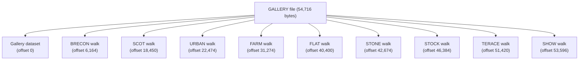
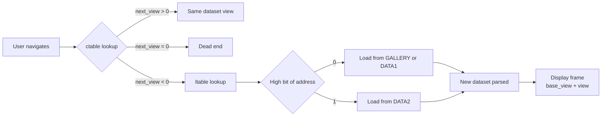

# BBC Domesday — File Format & Data Structure Documentation

This documentation describes the binary file formats and data structures used by the BBC Domesday National LaserDisc system, reverse-engineered from the BCPL source code found in `build/src/`.

## Document Map

```
docs/
├── index.md                      ← This file
├── tools/
│   └── cli-reference.md          ← CLI commands: catalogue, frame_index; disc compatibility notes
├── file-formats/
│   ├── gallery.md                ← GALLERY file layout + embedded walk sub-datasets
│   ├── names.md                  ← NAMES file: item title/type/address records (National)
│   ├── data-files.md             ← DATA1/DATA2: photo sets and national essays
│   ├── nm-dataset.md             ← NM mappable dataset binary format (frames, RLE, indexes)
│   └── community-files.md        ← Community disc: MAPDATA1, data bundles, INDEX, NAMES differences
├── data-structures/
│   ├── dataset-header.md         ← 60-byte dataset header (shared by all datasets)
│   ├── tables.md                 ← ctable, ltable, ptable, dtable formats
│   └── g-nw-vector.md            ← Runtime g.nw state vector (BCPL)
├── navigation/
│   ├── view-model.md             ← 8-direction view model and position arithmetic
│   ├── movement.md               ← Movement primitives and cross-dataset links
│   └── plan-navigation.md        ← Plan map display and click-to-navigate
└── bcpl-source/
    ├── manifest-constants.md     ← All header file manifest constants
    └── procedures.md             ← All BCPL procedure signatures and descriptions
```

## Overview

The BBC Domesday Project (1986) stores its National disc content across three binary files on the LaserDisc VFS (Virtual File System):

| File | Size | Purpose |
|------|------|---------|
| `GALLERY` | 54,716 bytes | Main gallery dataset + 9 embedded walk sub-datasets |
| `DATA1` | variable | Photo sets and national essays (overflow from GALLERY) |
| `DATA2` | variable | Additional photo sets and essays (high-address space) |
| `NAMES` | variable | Flat array of 36-byte item title/type/address records |

Each of the 9 walk environments (Brecon Beacons, Scotland, etc.) is stored as a self-contained dataset embedded directly inside the GALLERY file at a known byte offset.



## Quick Reference: Data Flow



## Key Concepts

- **View**: A single panoramic photograph, identified by a 1-based integer within its dataset.
- **Dataset**: A self-contained binary structure containing a 60-byte header followed by four tables (link, control, plan, detail).
- **Frame**: An absolute LaserDisc frame number. `frame = base_view + view`.
- **Plan**: An overhead map image. `plan_frame = base_plan + base_view + plan_number`.
- **syslev**: Dataset type flag — `1` = gallery mode, any other value = walk mode.

## Source Files Referenced

- `build/src/NW/walk1.b` — Main WALK BCPL module (navigation, detail, init)
- `build/src/NW/walk2.b` — Plan display and action module
- `build/src/H/nwhd.h` — National Walk manifest constants
- `build/src/H/nehd.h` — National Essay manifest constants
- `build/src/H/nphd.h` — National Photo manifest constants
- `build/src/H/sdhd.h` — Screen geometry constants
- `build/src/H/sthd.h` — System state table constants
