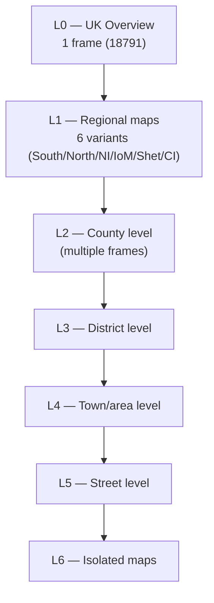

# Community Disc Modules

These modules are loaded from the Community disc (South or North). They share the community side of the cache vector.

---

## CM — Community Map

**Source**: `build/src/CM/` (map0–6.b, cm0–4.b)
**Headers**: `cmhd.h`, `cm2hd.h`, `cm3hd.h`

The Community Map module provides a multi-level zoomable map of Britain. Maps are stored on the LaserDisc as video frames. The map hierarchy has 7 levels (L0–L6), from a full UK overview down to individual streets.

### Map Hierarchy

### Map Static Vector (`G.cm.s`)

| Offset | Constant | Meaning |
|--------|----------|---------|
| 0–3 | `m.base`, `m.top`, `m.uptr`, `m.now` | Freespace management |
| 4 | `m.recptr` | Current map record number |
| 5 | `m.frame` | Current L0 video frame |
| 6 | `m.map` | Current map frame number |
| 7 | `m.parent` | Parent map frame |
| 8–9 | `m.x0`, `m.y0` | Current map easting/northing (hectometres) |
| 10 | `m.grid.system` | Grid system (GB/NI/Channel) |
| 11–14 | `m.a0/b0/a1/b1` | Screen offsets to submap grid corners |
| 15 | `m.cmlevel` | Current map level (0–6) |
| 16–17 | `m.width`, `m.height` | Map width/height in hectometres |
| 18–19 | `m.texts`, `m.photos` | Boolean: text/photo data available |
| 20 | `m.ptaddress` | Frame number of text/photo data bundle |
| 21–22 | `m.istart`, `m.iend` | Icon list byte offsets in map record |
| 32 | `m.clear.is.pending` | Display must be cleared on map exit |
| 33 | `m.substate` | Current sub-state |
| 39 | `m.data.accessed` | Video must be restored on redisplay |
| 40 | `m.measure` | Distance/Area measurement vector |
| 41 | `m.fhandle` | Mapdata file handle |

### L0 and L1 Map Frame Constants

| Constant | Value | Map |
|----------|-------|-----|
| `map.L0` | 18,791 | Frame of first UK L0 map |
| `L0.south` | 18,791 | South Britain L0 |
| `L0.north` | 18,792 | North Britain L0 |
| `L0.shet` | 18,793 | Shetland L0 |
| `L0.ire` | 18,794 | Ireland L0 |
| `L0.man` | 18,795 | Isle of Man L0 |
| `L0.chan` | 18,796 | Channel Islands L0 |
| `map.L1` | 18,797 | First L1 map frame |
| `L0.no.highlight` | 18,758 | L0 key frame (no overlay) |

### L1 Map Dimensions (hectometres)

| Region | Width | Height | Grid easting offset |
|--------|-------|--------|---------------------|
| Southern Britain | 6,000 | 4,800 | 0 |
| Northern Britain | 5,200 | 5,400 | 1,200 |
| Northern Ireland | — | — | — |
| Isle of Man | 400 | 600 | 90 |
| Shetland | 2,000 | 2,700 | 700 |
| Channel Islands | 800 | 900 | 100 |

### Map Cache

The map uses a freespace-managed LRU cache (`m.cm.cache.size = 500` words on the Archimedes). Each cached item has a 5-word header:
- `usage`: access count
- `lastused`: timer value when last accessed
- `id1`, `id0`: cache key
- `size`: item size in words

### Sub-states

| Constant | Value | Meaning |
|----------|-------|---------|
| `m.mapwalk.substate` | 0 | Normal map walking |
| `m.options.substate` | 1 | Options sub-state |
| `m.grid.ref.substate` | 2 | Grid reference entry |
| `m.key.substate` | 3 | Map key display |
| `m.distance1.substate` | 19 | Distance: no points |
| `m.distance2.substate` | 20 | Distance: some points |
| `m.area1.substate` | 38 | Area: no points |
| `m.area2.substate` | 39 | Area: banding |

### Display Flag Bits

| Constant | Bit | Effect |
|----------|-----|--------|
| `m.cm.frame.bit` | 0x01 | Show video frame |
| `m.cm.graphics.bit` | 0x02 | Draw graphics overlay |
| `m.cm.messages.bit` | 0x04 | Update message area |
| `m.cm.icons.bit` | 0x08 | Draw icons |

### Map Navigation (`cm2hd.h`)

Map direction constants for click interpretation:

| Constant | Value | Direction |
|----------|-------|-----------|
| `m.n` | 1 | North |
| `m.s` | 2 | South |
| `m.e` | 4 | East |
| `m.w` | 8 | West |
| `m.ne` | 5 | North-East |
| `m.nw` | 9 | North-West |
| `m.se` | 6 | South-East |
| `m.sw` | 10 | South-West |
| `m.up` | 16 | Zoom in |
| `m.down` | 32 | Zoom out |

---

## CO — Community Map Options

**Source**: `build/src/CO/` (mapopt1–8.b)
**Header**: `cm3hd.h`

Map Options provides three measurement tools: Scale (display scale of current map), Distance (measure path length), and Area (measure enclosed area).

### Measurement Vector Layout (`G.cm.s!m.measure`)

| Offset | Constant | Meaning |
|--------|----------|---------|
| 0 | `m.v.value` | Cumulative distance (fixed point) or total area |
| 4 | `m.v.next.point.ptr` | Pointer to next coordinate slot |
| 5 | `m.v.full` | True if coordinate storage is full |
| 6 | `m.v.units` | Metric or Imperial |
| 7–8 | `m.v.second.last.x/y` | Saved second-last point |
| 9 | `m.v.first.point` | First coordinate pair |
| 107 | `m.v.last.point` | Last (50th) coordinate pair |
| 209–210 | `m.v.co.xdir/ydir` | Direction from last point |
| 211–212 | `m.v.co.xco/yco` | Map coordinates of first point |

Up to 50 points can be stored (9 words offset between first and last: 98 slots).

### Unit Conversion Constants

| Constant | Value | Conversion |
|----------|-------|-----------|
| `m.metres.to.yards` | 10,940 | Multiply by this, divide by 10,000 |
| `m.km.to.miles` | 6,214 | Multiply by this, divide by 10,000 |
| `m.scale.sig.digits` | 3 | Output to 3 significant figures |

---

## CF — Community Find

**Source**: `build/src/CF/` (find0–8.b)
**Header**: `cfhd.h`

Community Find provides a full-text keyword search across all Community disc content. It uses a ranked retrieval algorithm (similar to TF-IDF) against an inverted index on the LaserDisc.

### Main Data Vector (`G.cf.p`)

Size: `m.cf.datasize` words. Layout:

| Range | Constant | Content |
|-------|----------|---------|
| 0–29 | — | Control slots (see below) |
| 33 | `p.oldq` | Previous query string (121 bytes) |
| `p.z` | — | Query control vector (30 terms × 10 words) |
| `p.m` | — | 101 best matches (404 words) |
| `p.t` | — | 21 current title records (756 bytes) |
| `p.q` | — | Current query string (121 bytes) |
| `p.s` | — | Statics cache (16 words) |

### Control Slots

| Offset | Constant | Meaning |
|--------|----------|---------|
| 0 | `c.state` | Internal FIND state |
| 1 | `c.index` | Index file locator |
| 2 | `c.names` | NAMES file locator |
| 3 | `c.termcount` | Number of query terms |
| 4 | `c.m` | First match offset in best-match vector |
| 5 | `c.mend` | End of best-match vector |
| 6 | `c.lev` | Map level for geographic filter |
| 7–10 | `c.x0/y0/x1/y1` | Bounding box for geographic filter |
| 11 | `c.h` | Worst match weight from last query |
| 14 | `c.max` | Maximum possible D-value |
| 16 | `c.box` | Currently highlighted result box |
| 17 | `c.titles` | Number of titles on current page |
| 18 | `c.bestmatch` | Sum of all term weights (best possible score) |
| 19 | `c.bestcount` | Count of perfect matches |
| 24 | `c.ws` | Workspace vector pointer |
| 25 | `c.wssize` | Workspace size in words |

### Query Term Control (`m.h = 10` words per term)

| Offset | Constant | Meaning |
|--------|----------|---------|
| 0 | `c.f` | Term frequency (items indexed by this term) |
| 1 | `c.w` | Weight (≈ log N/frequency) |
| 2–3 | `c.hl1/hl2` | Highlight range in query string |
| 4 | `c.p` | Pointer to term buffer B(t) |
| 5 | `c.sp` | Size of B(t) in words |
| 6 | `c.i` | Items read so far |
| 7 | `c.c` | Cursor offset in B(t) |
| 8–9 | `c.o` | Index file offset (2 words) |

### Title Record (36 bytes)

Each title entry in `p.t` is a community NAMES file record. **Note: the community NAMES
encoding differs from the National disc** (see `file-formats/community-files.md`):

| Bytes | Field | Notes |
|-------|-------|-------|
| 0–30 | Title string (31 chars) | Latin-1, space/null padded |
| 31 | `type_byte` | Bit 7: 0 = text item, 1 = photo item; bits 0–6 = page/picture number |
| 32–33 | `frame` | uint16 LE — LaserDisc frame number of the data bundle |
| 34–35 | (padding) | Unused |

### Internal States

| Constant | Value | Meaning |
|----------|-------|---------|
| `s.unset` | 0 | Initial state |
| `s.outsidebox` | 1 | Mouse outside result boxes |
| `s.atbox` | 2 | Mouse at a result box |
| `s.ing` | 3 | Entering geographic filter |
| `s.inn` | 4 | Geographic filter active |
| `s.inq` | 5 | Query entry active |
| `s.gr.ambig` | 6 | Ambiguous grid reference |
| `s.review` | 7 | Review/details state |

---

## CP — Community Photo

**Source**: `build/src/CP/` (cominit.b, compho1–2.b)
**Header**: `cphd.h`

Displays community disc photographs with short and long text captions. Each map record has associated frame data loaded as a 6 KB bundle.

### Context Vector (`G.cp.context`)

| Offset | Constant | Meaning |
|--------|----------|---------|
| 0 | `m.cp.level` | Map level |
| 1 | `m.cp.type` | Photo or text mode |
| 2 | `m.cp.picoff` | Byte offset to picture data |
| 3 | `m.cp.textoff` | Byte offset to text data |
| 4 | `m.cp.map.no` | Frame number of current map |
| 8–13 | `m.cp.box1`–`box6` | Local menu bar |
| 14 | `m.cp.textbox` | "Text" box content |
| 15 | `m.cp.npics` | Number of pictures in set |
| 16 | `m.cp.descr.siz` | Lines in long caption |
| 19 | `m.cp.phosub` | Photo sub-state |
| 22 | `m.cp.turn.on` | Video restore flag |

### Photo Sub-states

| Constant | Value | Meaning |
|----------|-------|---------|
| `m.cp.capt` | 1 | Short caption displayed |
| `m.cp.desc` | 2 | Long caption displayed |
| `m.cp.none` | 3 | No caption |

### Frame Bundle Size

Community photo frame data is stored in 6 KB (`m.cp.framesize = 6×1024 = 6144`) bundles on the LaserDisc.

### Caption Lengths

| Constant | Value | Meaning |
|----------|-------|---------|
| `m.cp.sclength` | 30 | Short caption characters |
| `m.cp.lclength` | 39 | Long caption chars per line |

---

## CT — Community Text

**Source**: `build/src/CT/` (ctext1–4.b, aatext1–4.b, gentext1–2.b)
**Header**: `cphd.h`

Community text content comes in two formats: Schools text (standard) and AA text (different header structure, used for Automobile Association-sourced articles).

### Text Data Structure (Schools)

| Bytes | Field |
|-------|-------|
| 0–1 | Page number (2 bytes) |
| 2–31 | Title including page bytes (30 bytes) |
| 32–35 | Cross-reference pointer (4 bytes) |
| 36 + n×858 | Text pages (858 bytes each = 22 lines × 39 chars) |

### AA Text Header

| Offset | Constant | Meaning |
|--------|----------|---------|
| 39 | `m.cp.header` | AA page header length (39 bytes) |
| 228 | `m.cp.AA.textoff` | Byte offset to number of pages in AA text |

The AA text format is structurally similar to the National Essay format, with its own 228-byte preamble before the page count and titles.

### Index/Contents Entry (36 bytes)

| Bytes | Content |
|-------|---------|
| 0–29 | Title string |
| 30–31 | Page number (2 bytes) |
| 32–35 | Padding |

Maximum 20 titles per index page (`m.cp.max.titles = 20`).
