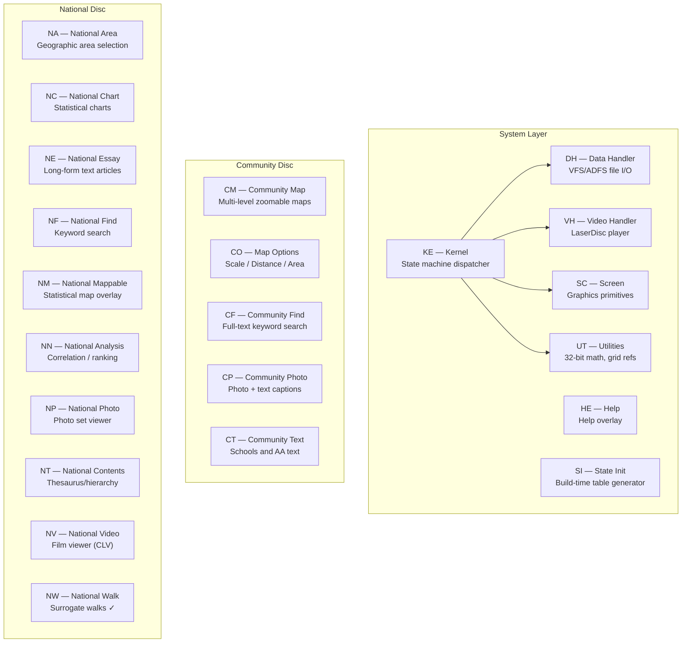

# Module Reference

This section documents all BCPL modules in the Domesday system beyond the National Walk (NW) module already covered in the main documentation. Each subsection covers one directory of source under `build/src/`.

## Module Inventory

## Quick Reference: Source Directories

| Dir | Module | BCPL Files | Header(s) | Description |
|-----|--------|-----------|-----------|-------------|
| `KE/` | Kernel | init, root, general, sram, kernel1, kernel2 | `glhd.h` | Core state machine |
| `DH/` | Data Handler | dh1, dh2, seldisc, userdata | `dhhd.h`, `dhphd.h` | File I/O |
| `VH/` | Video Handler | vh1, vh2, vh3 | `vhhd.h` | LaserDisc control |
| `SC/` | Screen | graph1-2, text1-3, input, menu, mouse, icon, etc. | `sdhd.h` | Graphics |
| `UT/` | Utilities | utils1-4, calc32b, grid1-2, print, write, bookmark | `uthd.h`, `grhd.h` | Utilities |
| `HE/` | Help | help0-1, helpA-D, helpinit, htext1-7 | `hehd.h` | Help overlay |
| `SI/` | State Init | stinit, r*/s* pairs | `stphd.h` | Build tool |
| `CM/` | Community Map | map0-6, cm0-4 | `cmhd.h`, `cm2hd.h`, `cm3hd.h` | Community maps |
| `CO/` | Map Options | mapopt1-8 | `cm3hd.h` | Distance/area |
| `CF/` | Community Find | find0-8 | `cfhd.h` | Full-text search |
| `CP/` | Community Photo | cominit, compho1-2 | `cphd.h` | Photo+text |
| `CT/` | Community Text | ctext1-4, aatext1-4, gentext1-2 | `cphd.h` | Text content |
| `NA/` | National Area | area0-4, area | `nahd.h` | Area selection |
| `NC/` | National Chart | chart0-8 | `nchd.h` | Charts |
| `NE/` | National Essay | natinit, ntext1-6 | `nehd.h` | Essays |
| `NF/` | National Find | find0-7, find9 | `nfhd.h` | National search |
| `NM/` | Nat. Mappable | 18 files | `nmhd.h` + privates | Stat. maps |
| `NN/` | Nat. Analysis | 30 files | `nmhd.h` | Analysis |
| `NP/` | National Photo | natinit, natpho1-3 | `nphd.h` | Photo sets |
| `NT/` | Nat. Contents | nt0-3 | `nthd.h` | Thesaurus |
| `NV/` | National Video | nv0-2 | `nvhd.h` | Film playback |
| `NW/` | National Walk | walk1-2 | `nwhd.h` | Walks ✓ |

See per-module documents in this folder for details.
