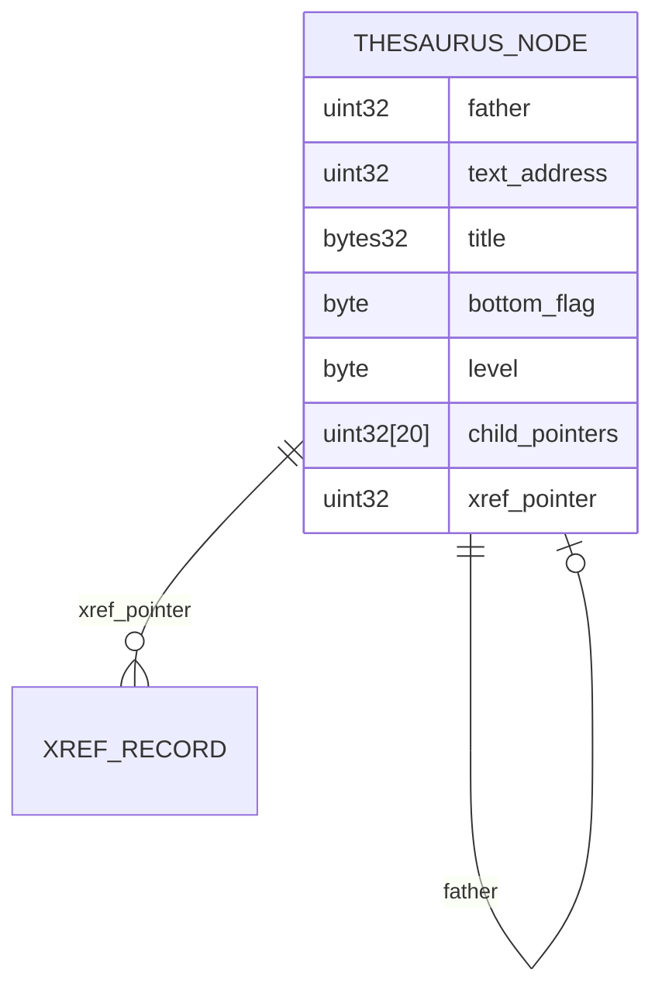
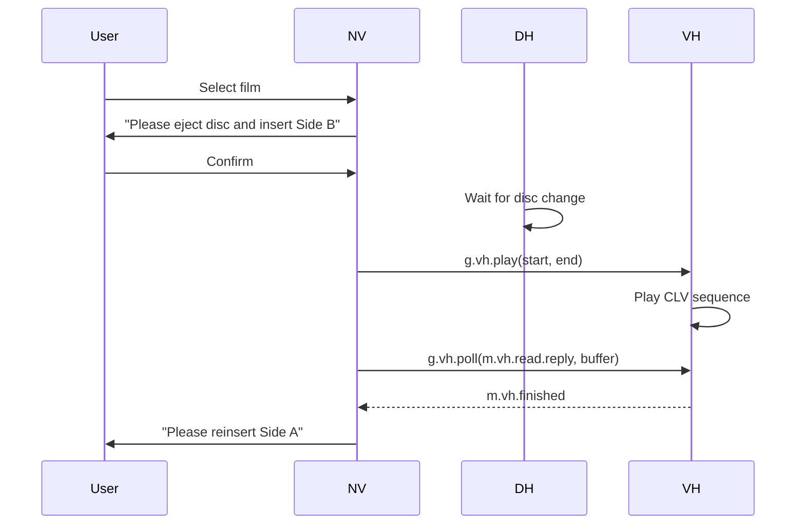

# National Disc Modules

These modules handle content on the National disc (Side A: CAV, interactive content; Side B: CLV, film). The National Walk (NW) module is documented separately in the main docs.

---

## NT — National Contents / Thesaurus

**Source**: `build/src/NT/` (nt0–3.b)
**Header**: `nthd.h`

NT provides access to the hierarchical topic thesaurus — a structured index of all national disc content. Topics are organised in a tree (up to 20 children per node), with cross-references between related topics.

### Thesaurus Record Format (128 bytes)

The hierarchy file (`THESDATA`) contains fixed-size 128-byte records:

| Bytes | Field | Constant | Description |
|-------|-------|----------|-------------|
| 0–3 | `father` | `m.nt.father` | 32-bit offset to parent record |
| 4–5 | `pic` | `m.nt.pic` | Unused |
| 6–9 | `text` | `m.nt.text` | 32-bit item address of level-2 essay |
| 10–41 | `title` | `m.nt.title` | 32-byte title: 1-byte length + 30 chars + pad |
| 42 | `bottomflag` | `m.nt.bottomflag` | `128` = bottom level (leaf node) |
| 43 | `level` | `m.nt.level` | Depth in thesaurus |
| 44–123 | `HDPs` | `m.nt.HDPs` | 20 × 4-byte child record offsets |
| 124–127 | `xref` | `m.nt.xref` | 32-bit offset to cross-reference area |

### Item Record Format (NAMES file)

| Bytes | Field | Constant |
|-------|-------|----------|
| 0–30 | Name (31 chars) | `m.nt.itemname` |
| 31 | Type | `m.nt.itemtype` |
| 32–35 | 32-bit item address | `m.nt.itemaddr` |

Standard size: 36 bytes (`m.nt.item.rec.size`). PUK version: 40 bytes (`m.nt.NAMES.rec.size`).

### Cross-Reference Area

- 2 header words: count of cross-references
- Followed by `count × 4` bytes of 32-bit pointers to thesaurus records
- Maximum: 500 cross-references (`m.nt.maxxrefs`)

### Statics (`G.nt.s`)

| Offset | Constant | Meaning |
|--------|----------|---------|
| 0 | `m.nt.curr.high.no` | Currently highlighted list item |
| 1 | `m.nt.in.xref` | True if showing cross-references |
| 2 | `m.nt.xref.page.no` | Current xref page (from 0) |
| 3 | `m.nt.num.items` | Total bottom-level items for this term |
| 4 | `m.nt.num.xrefs` | Total cross-references |
| 5 | `m.nt.num.lines` | Lines on current screen |

---

## NA — National Area

**Source**: `build/src/NA/` (area0–4.b, area.b)
**Header**: `nahd.h`

NA allows the user to select a geographic area of interest, either by entering a grid reference or by naming an administrative unit. It interfaces with the Gazetteer file and feeds the selected area to the NM module.

### Buffer Layout (`G.na.buff`)

Total: 4,200 words. The first `m.na.frame` words (`= 6114/BYTESPERWORD = 3057`) form the frame buffer. Context variables follow:

| Offset from `m.na.frame` | Constant | Meaning |
|--------------------------|----------|---------|
| 0 | `m.na.vid.req` | Video needs to be switched on |
| 1 | `m.na.format` | Input format: `m.na.grid` or `m.na.name` |
| 2 | `m.na.box` | Current input box |
| 3 | `m.na.screen.state` | Screen state (1–3) |
| 6 | `m.na.country` | `'W'`=Wales, `'N'`=Northern Ireland |
| 7–30 | `m.na.gbuff` | 48-byte gazetteer record buffer |
| 31–46 | `m.na.auname` | Administrative unit name (32 bytes) |
| 47–62 | `m.na.autype` | Administrative unit type (32 bytes) |
| 63–68 | `m.na.gr1` | Grid Reference 1 (12 bytes) |
| 69–74 | `m.na.gr2` | Grid Reference 2 (12 bytes) |

### UK Bounding Box Constants (hectometres)

| Region | BL Easting | BL Northing | TR Easting | TR Northing |
|--------|-----------|------------|-----------|------------|
| UK overall | -11,600 | -980 | 7,550 | 13,200 |
| Channel Islands | 5,000 | 54,250 | 6,000 | 55,250 |
| Northern Ireland | 1,600 | 3,000 | 4,000 | 4,800 |

### Gazetteer Record

| Bytes | Content |
|-------|---------|
| 0–1 | Record type |
| 2–33 | Name/type string (32 bytes) |
| 34 | Number of AU names (type records) |
| 36+ | Name area (name records) |

Record size: 48 bytes (`m.na.gazrecordbytes`).

---

## NF — National Find

**Source**: `build/src/NF/` (find0–7.b, find9.b)
**Header**: `nfhd.h`

National Find is a simplified version of Community Find, adapted for the National disc index structure. It supports keyword search and filename search, with a hierarchical item structure.

### Key Differences from Community Find

- Item records include hierarchy data (40 bytes vs 36 for CF)
- 5 search group omission slots (`c.include`, offset 30)
- Supports filename search (`m.file`) as well as keyword search (`m.keyword`)
- Index items are 4 bytes (vs 8 bytes in CF): `m.biisize = 4`

### Item Record (40 bytes)

| Bytes | Field |
|-------|-------|
| 0–30 | Name (31 chars) |
| 31 | Type byte |
| 32–35 | 32-bit address |
| 36–39 | Hierarchy pointer (`m.itemh.level`) |

---

## NM — National Mappable Data

**Source**: `build/src/NM/` (18 files)
**Headers**: `nmhd.h`, `nmcphd.h`, `nmclhd.h`, `nmldhd.h`, `nmrehd.h`, `nmcohd.h`

NM provides statistical map overlays — choropleth maps showing demographic and environmental data across a grid of squares or administrative areas. This is one of the most complex modules in the system.

> **On-disc binary format**: see [`docs/file-formats/nm-dataset.md`](../file-formats/nm-dataset.md) for the full frame/sector model, dataset header layout, sub-dataset index, coarse/fine block indexing, RLE encoding, and areal values format.

### Data Types

| Constant | Value | Meaning |
|----------|-------|---------|
| `m.nm.grid.mappable.data` | 1 | Regular grid squares |
| `m.nm.areal.boundary.data` | 2 | Administrative area boundaries |
| `m.nm.areal.mappable.data` | 3 | Administrative area values |

### Value Types

| Constant | Value | Meaning |
|----------|-------|---------|
| `m.nm.absolute.type` | 0 | Raw counts |
| `m.nm.ratio.and.numerator.type` | 1 | Ratio with numerator |
| `m.nm.percentage.and.numerator.type` | 4 | Percentage |
| `m.nm.incidence.type` | 5 | Rate per population |
| `m.nm.categorised.type` | 6 | Category codes |

### Display Resolution

| Constant | Value | Meaning |
|----------|-------|---------|
| `m.nm.pixel.width` | 320 | Horizontal pixels for map |
| `m.nm.pixel.height` | 220 | Vertical pixels for map |
| `m.nm.x.pixels.to.graphics` | 4 | Graphics units per pixel (H) |
| `m.nm.y.pixels.to.graphics` | 4 | Graphics units per pixel (V) |

### Global Statics (`G.nm.s`)

The statics vector is large — over 360 words. Key sections:

**Area of interest** (offsets 1–26):

| Offset | Constant | Meaning |
|--------|----------|---------|
| 1–4 | `m.nm.km.low.e/top.e/low.n/top.n` | Area of interest in kilometres |
| 5–8 | `m.nm.grid.sq.low.e`… | In grid squares |
| 13–16 | `m.nm.blk.low.e`… | In coarse blocks |
| 21–22 | `m.nm.x/y.graph.per.grid.sq` | Graphics coordinates per grid square |
| 23–26 | `m.nm.x/y.min/max` | Display window in graphics coordinates |

**Dataset header** (offsets 27–54):

| Offset | Constant | Meaning |
|--------|----------|---------|
| 27 | `m.nm.dataset.record.number` | Absolute record number of dataset |
| 28 | `m.nm.dataset.type` | Grid/areal/boundary |
| 29–30 | `m.nm.private.text.address` | 32-bit address of private text |
| 31–32 | `m.nm.descriptive.text.address` | 32-bit address of descriptive text |
| 33–34 | `m.nm.technical.text.address` | 32-bit address of technical text |
| 35 | `m.nm.value.data.type` | Type of values |
| 36 | `m.nm.raster.data.type` | Raster data representation |
| 37–38 | `m.nm.sub.dataset.index.record/offset` | Index location |
| 41–44 | `m.nm.gr.start/end.e/n` | Data grid reference range |
| 45–46 | `m.nm.primary/secondary.norm.factor` | Normalising factors |

**Classification** (55+):

Five class intervals (`m.nm.num.of.class.intervals = 5`) with:
- Equal class cut-points
- Nested means cut-points
- Quantile cut-points

Each cut-point set is stored as `(m.nm.num.of.class.intervals + 1) × 4` bytes (32-bit values).

### Data Format

Data is packed on the LaserDisc as raster frames. Each frame: `6,144` bytes = 24 sectors × 256 bytes.

- **Grid data**: 1 value per grid square, `m.nm.max.data.size = 4/BYTESPERWORD` words
- **Areal data**: values for up to `m.nm.max.num.areas = 1935` areas
- **Missing data**: encoded as `m.nm.uniform.missing = 0x8000`

### Coarse/Fine Block Indexing

- **Coarse block**: `m.nm.coarse.blocksize = 32` grid squares
- **Fine block**: `m.nm.fine.blocksize = 8` grid squares (coarse/4)
- **Coarse index size**: up to 1,363 entries

### Colour Scheme

NM uses a 10-colour logical colour palette (Mode 2):

| Logical Colour | Constant | Role |
|----------------|----------|------|
| 0 | `m.sd.black2` | Background / missing |
| 4 | `m.nm.white` | Always white |
| 5 | `m.nm.flash.white` | Flashing highlight |
| 6–10 | `m.nm.fg.col.base` | Key foreground colours |
| 11–15 | `m.nm.bg.col.base` | Map background (data) colours |

---

## NN — National Map Analysis

**Source**: `build/src/NN/` (30 files)
**Headers**: `nmhd.h`, `nmrehd.h`, `nmclhd.h`

NN provides the statistical analysis operations on national mappable data: Retrieve (look up individual values), Compare (show two datasets together), Correlate (statistical correlation), and Rank (ranked list of areas).

### Operations

| Sub-module files | Operation |
|-----------------|-----------|
| `analyse1–4.b` | Automatic classification (equal/nested/quantiles) |
| `compare1–2.b` | Side-by-side dataset comparison |
| `correl1–2.b` | Pearson correlation coefficient |
| `detail1–2.b` | Detail display for individual grid squares |
| `display1–2.b` | Map rendering to screen |
| `load1–2.b` | Dataset loading from disc |
| `map1–3.b` | Map display management |
| `manual1–2.b` | Manual class interval entry |
| `process.b` | Data processing pipeline |
| `rank.b`, `rankop1–4.b`, `sortrank.b` | Ranked area list |
| `retr1–4.b` | Value retrieval |
| `unpack.b` | Data decompression |
| `utils.b`, `utils2.b` | NM utility routines |
| `auto1–4.b` | Automatic operation drivers |
| `class32.b` | 32-bit classification |
| `context.b` | Context management |
| `mpadd.b`, `mpconv.b`, `mpdisp.b`, `mpdiv.b` | Multi-precision arithmetic |
| `plot.b` | Map cell plotting |
| `tiefactor.b`, `treesort.b` | Ranking support |
| `valid.b` | Data validation |
| `window.b` | Display window management |
| `write.b` | Output to disc |
| `name.b` | Area name lookup |
| `link.b` | Linked display management |
| `fpwrite.b` | Floating-point output formatting |

### Retrieve Context Variables (`nmrehd.h`)

| Constant | Offset | Meaning |
|----------|--------|---------|
| `m.local.state` | `gen.purp` | Local retrieve state |
| `m.saved` | +1 | Screen saved flag |
| `m.restore` | +2 | Screen restore flag |
| `m.sum.total` | +3 | 3-word sum for area totals |
| `m.flash.colour` | +7 | Colour of flashing indicator square |
| `m.flash.e/n` | +8/9 | Easting/northing of flash square |
| `m.flash.sq.e/n` | +10/11 | Grid square reference |
| `m.area.no` | +12 | Current area number |
| `m.gaz.record` | +13 | 48-byte Gazetteer record buffer |
| `m.nm.rpage` | +written | Current Rank page |
| `m.nm.num.values` | +written | Non-missing value count |
| `m.nm.grand.total` | +written | 3-word grand total |
| `m.nm.rank.pages` | +written | Pages in Rank list |
| `m.nm.ritems.page` | 8 | Items per Rank page |

---

## NC — National Chart

**Source**: `build/src/NC/` (chart0–8.b)
**Header**: `nchd.h`

NC displays statistical charts (bar charts, pie charts, time series line graphs) derived from national dataset header information.

### Chart Types

| Constant | Value | Type |
|----------|-------|------|
| `m.nc.bar` | 1 | Simple bar chart |
| `m.nc.BtoB` | 2 | Back-to-back bar chart |
| `m.nc.looping` | 6 | Animated looping bar chart |
| `m.nc.pie` | 7 | Pie chart |
| `m.nc.STSLG` | 8 | Single-line time series |
| `m.nc.MTSLG` | 10 | Multi-line time series |

### Dataset Header Layout (byte offsets into `G.nc.area`)

| Offset | Constant | Field |
|--------|----------|-------|
| 0 | `m.nc.vars` | Number of variables/dimensions |
| 26 | `m.nc.datoff` | Byte offset to data area |
| 30 | `m.nc.dsize` | Data size per value (1, 2, or 4 bytes) |
| 31 | `m.nc.add` | Flag |
| 32 | `m.nc.norm` | Normalising factor |
| 36 | `m.nc.s.f` | `'M'` (multiply) or `'D'` (divide) by norm |
| 37 | `m.nc.sfe` | `'E'` (exponent) or `' '` (value) |
| 42 | `m.nc.dm` | 10-byte list of available display methods |
| 52 | `m.nc.defdis` | Default display method |
| 53 | `m.nc.colset` | 3-byte colour set (BBC colours) |
| 56+ | `m.nc.labels.b` | Label region start |

### Screen Layout Constants

| Constant | Value | Area |
|----------|-------|------|
| `m.nc.cx/cy` | 160, 252 | Chart area bottom-left |
| `m.nc.cw/cd` | 796, 588 | Chart area width/height |
| `m.nc.centrex/y` | 476, 546 | Pie chart centre |
| `m.nc.radius` | 282 | Pie chart radius |

---

## NV — National Video (Film)

**Source**: `build/src/NV/` (nv0–2.b)
**Header**: `nvhd.h`

NV plays film sequences from Side B (CLV) of the National disc. Since CLV doesn't support still-frame, NV manages disc flip — requiring the user to eject Side A and load Side B.

> **Note**: The NV module (`l.film`) is noted in the README as **orphaned** — it is not linked into the final kernel image and is therefore not accessible in the shipped product.

### Film Data Record (340 bytes)

| Bytes | Field | Constant |
|-------|-------|----------|
| 0–27 | Standard 28-byte National header | — |
| 28–31 | Unused | — |
| 32–33 | Number of films | `m.nv.number.offset` − 28 |
| 34–35 | Disc ID (not used) | `m.nv.disc.id.offset` |
| 36–67 | Disc title, 32 bytes (not used) | `m.nv.disc.title.offset` |
| 68–101 | Initial film entry (34 bytes) | `m.nv.first.entry.offset` |
| 102+ | Full film list | `m.nv.list.offset` |

Each film entry is 34 bytes (`m.nv.entry.size`), containing the film title, frame numbers, and description.

### Sub-states

| Constant | Value | Meaning |
|----------|-------|---------|
| `m.nv.initial.substate` | 1 | Just entered |
| `m.nv.entry.question.substate` | 2 | Awaiting "Eject disc?" confirmation |
| `m.nv.play.substate` | 3 | Film playing (polling) |
| `m.nv.select.substate` | 4 | Film selection menu |
| `m.nv.help.substate` | 5 | Private help (real Help unavailable) |
| `m.nv.exit.question.substate` | 6 | Awaiting confirmation to flip back to Side A |

### Play Flow

