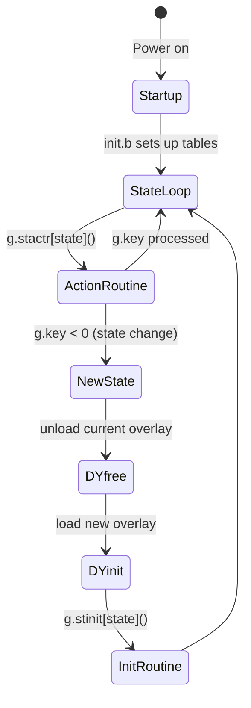

# System Layer Modules

These modules form the core infrastructure. They are linked into the single `r.kernel` executable and are always present, regardless of which disc or feature is active.

---

## KE — Kernel

**Source**: `build/src/KE/` (init.b, root.b, general.b, sram.b, kernel1.b, kernel2.b)

The Kernel is the top-level state machine dispatcher. It initialises the system and drives the main event loop, calling the appropriate action routine for the current state on every cycle.

### State Machine Architecture



### Key Global Variables (from `glhd.h`)

| Global | Offset | Meaning |
|--------|--------|---------|
| `G.context` | FG+15 | Pointer to context data vector |
| `G.key` | FG+12 | Last keypress / pending state change (negative = state) |
| `G.screen` | FG+11 | Current coordinate system (menu/display/message) |
| `G.Xpoint` | FG+13 | Mouse X position |
| `G.Ypoint` | FG+14 | Mouse Y position |
| `G.stover` | FG+0 | Current overlay name |
| `G.stactr` | FG+1 | Current action routine function pointer |
| `G.stinit` | FG+3 | Current init routine function pointer |
| `G.stDYinit` | FG+5 | Dynamic init routine |
| `G.stDYfree` | FG+6 | Dynamic free routine |
| `G.menubar` | FG+8 | Menu bar box data pointer |
| `G.menuwords` | FG+7 | Array of menu label word strings |

### Context Vector Layout (from `glhd.h`)

The `G.context` vector is 62 words long and holds cross-module shared state:

| Offset | Constant | Meaning |
|--------|----------|---------|
| 0 | `m.state` | Current system state |
| 1 | `m.laststate` | Previous state |
| 2 | `m.discid` | Which LaserDisc is loaded |
| 3 | `m.stackptr` | Exit stack pointer |
| 4 | `m.leveltype` | Map level and type |
| 5–8 | `m.grbleast`…`m.grtrnorth` | Grid reference bounding box |
| 9 | `m.frame.no` | Current LaserDisc frame |
| 10 | `m.page.no` | Current essay page |
| 11 | `m.picture.no` | Current photo number |
| 12 | `m.areal.unit` | Areal unit code (0 = grid square) |
| 13 | `m.resolution` | Dataset resolution (1–10 km) |
| 16–35 | `m.itemrecord` | 36-byte NAMES record for selected item |
| 36 | `m.flags` | General flags |
| 42 | `m.justselected` | True when pending state change was used |
| 50 | `m.itemselected` | True when returning from item examination |
| 56–59 | `m.itemadd2/3` | Chained essay addresses |
| 61 | `m.contextsize` | Vector size parameter |

### Menu Words (`sihd.h`)

All menu bar labels are stored as a packed word list referenced by word offsets. Total list size: 792 bytes. Key menu words (with their offsets):

| Constant | Offset | Label |
|----------|--------|-------|
| `m.wGallery` | 65 | "Gallery" |
| `m.wWalk` | 171 | "Walk" |
| `m.wForward` | 183 | "Forward" |
| `m.wMove` | 181 | "Move" |
| `m.wLmove` | 163 | "<Move" |
| `m.wRmove` | 165 | ">Move" |
| `m.wPlanHelp` | 185 | "Plan/Help" |
| `m.wBack` | 13 | "Back" |
| `m.wFind` | 61 | "Find" |
| `m.wMap` | 87 | "Map" |
| `m.wText` | 147 | "Text" |
| `m.wPhoto` | 103 | "Photo" |
| `m.wChart` | 175 | "Chart" |
| `m.wFilm` | 173 | "Film" |
| `m.wContents` | 29 | "Contents" |

### Disc Identifiers (`dhhd.h`)

| Constant | Value | Disc |
|----------|-------|------|
| `m.dh.not.domesday` | 0 | Unknown disc |
| `m.dh.south` | 2 | Community South disc |
| `m.dh.north` | 4 | Community North disc |
| `m.dh.natA` | 8 | National disc Side A (CAV, interactive) |
| `m.dh.natB` | 16 | National disc Side B (CLV, film) |

### Overlay Film Frames (`ovhd.h`)

| Constant | Frame | Meaning |
|----------|-------|---------|
| `m.ov.cfilmS` | 51 | Community disc intro film start |
| `m.ov.cfilmE` | 1600 | Community disc intro film end |
| `m.ov.nfilmS` | 51 | National disc intro film start |
| `m.ov.nfilmE` | 803 | National disc intro film end |

---

## DH — Data Handler

**Source**: `build/src/DH/` (dh1.b, dh2.b, seldisc.b, userdata.b)
**Headers**: `dhhd.h`, `dhphd.h`

The Data Handler provides the file I/O abstraction layer. All other modules access data through DH, which handles both VFS (Virtual File System, on the LaserDisc) and ADFS (Acorn Disc Filing System, on the floppy) transparently.

### Key Global Functions

| Global | Description |
|--------|-------------|
| `G.dh.open(name)` | Open a named file; returns file handle |
| `G.dh.close(handle)` | Close a file |
| `G.dh.read(handle, offset, buffer, length)` | Read `length` bytes from `offset` into `buffer` |
| `G.dh.readframes(handle, frame, buffer, n)` | Read `n` LaserDisc frames from `frame` |
| `G.dh.length(handle)` | Return file length in bytes (32-bit) |
| `G.dh.fstype()` | Return filing system type |
| `G.dh.discid()` | Return current disc identifier |
| `G.dh.select.disc(id)` | Eject and load a different disc |
| `G.dh.SCSI.error()` | Retrieve last SCSI error code |

### VFS Constants (`dhhd.h`)

| Constant | Value | Meaning |
|----------|-------|---------|
| `m.dh.bytes.per.sector` | 256 | VFS sector size |
| `m.dh.sectors.per.frame` | 24 | VFS sectors per LaserDisc frame |
| `m.dh.bytes.per.frame` | 6,144 | Total bytes per frame (24 × 256) |
| `m.dh.none` | 0 | No filing system |
| `m.dh.adfs` | 8 | ADFS (floppy) |
| `m.dh.vfs` | 10 | VFS (LaserDisc) |

---

## VH — Video Handler

**Source**: `build/src/VH/` (vh1.b, vh2.b, vh3.b)
**Header**: `vhhd.h`

The Video Handler communicates with the Philips VP415 LaserDisc player via F-codes (frame control codes). It provides frame display, video mode control, audio selection, and player status polling.

### Key Global Functions

| Global | Description |
|--------|-------------|
| `G.vh.frame(n)` | Seek and display frame `n` |
| `G.vh.play(start, end)` | Play frames from `start` to `end` |
| `G.vh.goto(n)` | Seek to frame `n` without display |
| `G.vh.step(mode)` | Pause player (`m.vh.stop`) |
| `G.vh.video(mode)` | Set video overlay mode |
| `G.vh.audio(channel)` | Select audio channel |
| `G.vh.poll(mode, buffer)` | Poll player status |
| `G.vh.reset()` | Reset the LaserDisc player |

### Video Modes (`vhhd.h`)

| Constant | Value | Effect |
|----------|-------|--------|
| `m.vh.lv.only` | `'1'` | LaserDisc video only (no graphics) |
| `m.vh.micro.only` | `'2'` | BBC Micro graphics only (no disc video) |
| `m.vh.superimpose` | `'3'` | Graphics over disc video |
| `m.vh.transparent` | `'4'` | Transparent overlay |
| `m.vh.highlight` | `'5'` | Highlight overlay |
| `m.vh.video.off` | `'8'` | Video off |
| `m.vh.video.on` | `'9'` | Video on (unmute) |

### Audio Channels

| Constant | Value | Channel |
|----------|-------|---------|
| `m.vh.no.channel` | `'0'` | Mute |
| `m.vh.right.channel` | `'1'` | Right only |
| `m.vh.left.channel` | `'2'` | Left only |
| `m.vh.both.channels` | `'3'` | Both channels |

### Disc Types (Player Status)

| Constant | Value | Meaning |
|----------|-------|---------|
| `m.vh.CAV` | `0x01` | CAV disc (interactive, still-frame capable) |
| `m.vh.CLV` | `0x02` | CLV disc (long-play, film side) |

---

## SC — Screen

**Source**: `build/src/SC/` (graph1-2.b, text1-3.b, input.b, menu.b, mouse.b, icon.b, setfont.b, number.b, virtual.b, getact.b, textlnk.b, chart9.b)
**Header**: `sdhd.h`

The Screen module provides all graphics, text, and input primitives. It operates in BBC Micro graphics mode 2 (320×256 pixels, 16 colours).

### Coordinate Systems

BBC graphics units are used throughout. The screen is divided into three areas:

```
┌────────────────────────────────────┐  ← 1023 (top of screen)
│  Message Area  (Y 976–1023)        │  48 graphics units tall
├────────────────────────────────────┤  ← 976
│                                    │
│  Display Area  (Y 76–963)          │  888 graphics units tall
│                                    │  1280 graphics units wide
├────────────────────────────────────┤  ← 76
│  Menu Bar      (Y 0–75)            │  76 graphics units tall
└────────────────────────────────────┘  ← 0
```

### Key Primitives

| Global | Description |
|--------|-------------|
| `G.sc.movea(area, x, y)` | Move graphics cursor to `(x,y)` in `area` |
| `G.sc.linea(mode, x, y)` | Draw line to absolute `(x,y)` |
| `G.sc.liner(mode, dx, dy)` | Draw line relative |
| `G.sc.rect(mode, x, y, w, h)` | Draw filled rectangle |
| `G.sc.triangle(mode, dx1, dy1, dx2, dy2)` | Draw filled triangle |
| `G.sc.parallel(mode, dx1, dy1, dx2, dy2)` | Draw parallelogram |
| `G.sc.clear(area)` | Clear display, menu, or message area |
| `G.sc.selcol(colour)` | Select drawing colour |
| `G.sc.mess(text)` | Output text to message area |
| `G.sc.ermess(text)` | Output error message (with delay) |
| `G.sc.menu(v)` | Draw menu bar from 6-word vector |
| `G.sc.icon(type, mode)` | Draw icon at current position |
| `G.sc.opage(buffer, length)` | Output formatted text page |
| `G.sc.input(buffer, ...)` | Keyboard text entry with cursor |
| `G.sc.pointer(on/off)` | Show/hide mouse pointer |
| `G.sc.getact()` | Get user action (key + mouse) |

---

## UT — Utilities

**Source**: `build/src/UT/` (utils1-4.b, calc32b.b, grid1-2.b, print.b, write.b, bookmark.b, helplnk.b, download.b, errtext.b, FPlib.b, RCPlib.b)
**Headers**: `uthd.h`, `grhd.h`

Utility functions used by all other modules.

### 32-bit Integer Arithmetic

All arithmetic is done on 32-bit quantities stored as two consecutive 16-bit words:

| Global | Description |
|--------|-------------|
| `G.ut.set32(lo, hi, v)` | Store 32-bit value into 2-word vector `v` |
| `G.ut.get32(v, lv.hi)` | Retrieve: returns lo word, stores hi to `lv.hi` |
| `G.ut.mov32(src, dst)` | Copy 2-word vector |
| `G.ut.add32(a, b)` | `b := b + a` (both 2-word) |
| `G.ut.sub32(a, b)` | `b := b - a` |
| `G.ut.mul32(a, b)` | `b := b × a` |
| `G.ut.div32(a, b)` | `b := b / a` |
| `G.ut.cmp32(a, b)` | Returns `m.lt`, `m.eq`, or `m.gt` |
| `G.ut.unpack16(v, offset)` | Read unsigned int16 at byte offset |
| `G.ut.unpack16.signed(v, offset)` | Read signed int16 at byte offset |
| `G.ut.unpack32(v, offset, dst)` | Read uint32 from byte offset into 2-word vector |

### Grid Reference Library (`grhd.h`)

Converts between OS Grid References (hectometres) and the various UK grid systems:

| Grid System | Constant | Value |
|-------------|----------|-------|
| GB (Great Britain) | `m.grid.is.GB` | 8 |
| GB Southern region | `m.grid.is.South` | 9 |
| GB Northern region | `m.grid.is.North` | 10 |
| Domesday wall area | `m.grid.is.Domesday.wall` | 11 |
| Isle of Man | `m.grid.is.IOM` | 12 |
| Shetland | `m.grid.is.Shet` | 13 |
| Northern Ireland | `m.grid.is.NI` | 16 |
| Channel Islands | `m.grid.is.Channel` | 32 |

### Bookmark System

Saves/restores the full system state to/from a floppy disc bookmark file, preserving the entire `G.he.save` vector (context + menu bar + palette + module state).

### Cache / SRAM System (`iohd.h`)

Persistent state is stored in a 64 KB cache vector (`G.CacheVec`) divided between National and Community module save areas:

```
G.CacheVec [64KB total]
├── Bookmark area                 [464 bytes]
├── National areas
│   ├── NP (photo) cache         [52 bytes]
│   ├── NF (find) cache          [4128 bytes]
│   ├── NM areal vector          [8192 bytes]
│   ├── NM areal map             [244 bytes]
│   ├── NM class intervals       [28 bytes]
│   ├── NM class colours         [24 bytes]
│   ├── NM statics               [2070 bytes]
│   ├── NT thesaurus data        [2692 bytes]
│   ├── NT item data             [804 bytes]
│   ├── NT statics               [28 bytes]
│   ├── NC chart cache           [3544 bytes]
│   ├── NV film statics          [0 bytes - orphaned]
│   ├── NW walk cache            [100 bytes]
│   ├── NA area cache            [324 bytes]
│   └── NE essay cache           [808 bytes]
└── Community areas
    ├── CP photo cache           [984 bytes]
    ├── CF find cache            [4020 bytes]
    ├── CM map statics           [184 bytes]
    ├── CM map cache             [20004 bytes]
    ├── CM keep vector           [84 bytes]
    ├── CM map options cache     [868 bytes]
    └── CP frame buffer          [6148 bytes]
```

---

## HE — Help

**Source**: `build/src/HE/` (help0-1.b, helpA-D.b, helpinit.b, htext1-7.b)
**Header**: `hehd.h`

The Help overlay provides context-sensitive help text, gazetteer lookups for area information, bookmark management, and a status page. It can be entered from any state and returns to the previous state on exit.

### Help Working Vector (`G.he.work`)

| Slot | Constant | Meaning |
|------|----------|---------|
| 0–5 | `m.he.box1`–`m.he.box6` | Local menu bar box states |
| 7 | `m.he.gotmark` | Bookmark exists flag |
| 8 | `m.he.gazhandle` | Gazetteer file handle |
| 9 | `m.he.gazpage` | Current gazetteer page number |
| 11 | `m.he.lastpage` | True if last gazetteer page |
| 12 | `m.he.name.no` | Sequential gazetteer name record number |
| 22 | `m.he.esstackptr` | Chained essays stack pointer |

### Save Vector (`G.he.save`)

Preserved as part of bookmark: contains a complete copy of `G.context`, the menu bar, palette (16 colours), and all module cache flags.

### Gazetteer Record Format

| Byte Offset | Field | Size |
|-------------|-------|------|
| 2 | Name/type string | 32 bytes |
| 34 | Number of AU names (type record) | 1 byte |
| 36 | Address to names area (type record) | — |
| 42 | Nth name record number (name record) | — |
| 46 | Mapdata record number (name record) | — |

Total record size: 48 bytes (`m.he.rec.size`).

---

## SI — State Init

**Source**: `build/src/SI/` (stinit.b, rcom.b, rexam.b, rgalwal.b, rhe.b, rnm.b, rsear.b, scom.b, sexam.b, sgalwal.b, she.b, snm.b, ssear.b)
**Header**: `stphd.h`

STINIT is a **build-time tool** only — it is not part of the runtime Domesday system. It generates the binary state tables (`G.stover`, `G.stactr`, `G.stinit`, `G.sttran`, `G.stmenu`) that the Kernel uses at runtime.

Each `r*.b` file defines the state table rows for a group of states; each `s*.b` file generates the corresponding menu bar configurations.

State groups:
- `rcom`/`scom` — Community disc states
- `rexam`/`sexam` — Item examination states
- `rgalwal`/`sgalwal` — Gallery and Walk states
- `rhe`/`she` — Help states
- `rnm`/`snm` — National Mappable states
- `rsear`/`ssear` — Search (Find) states

### Font Manager (`fmhd.h`)

The A500 (Archimedes) port uses RISC OS Arthur font manager SWIs for text rendering. SWI base: `0x40080`.

### Window Manager (`wmhd.h`)

The A500 port also provides a WIMP (Windows, Icons, Menus, Pointer) layer via SWIs at base `0x400C0`. This is used for the virtual keyboard and certain overlay operations.
