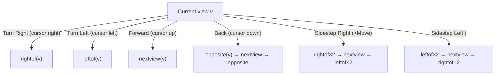
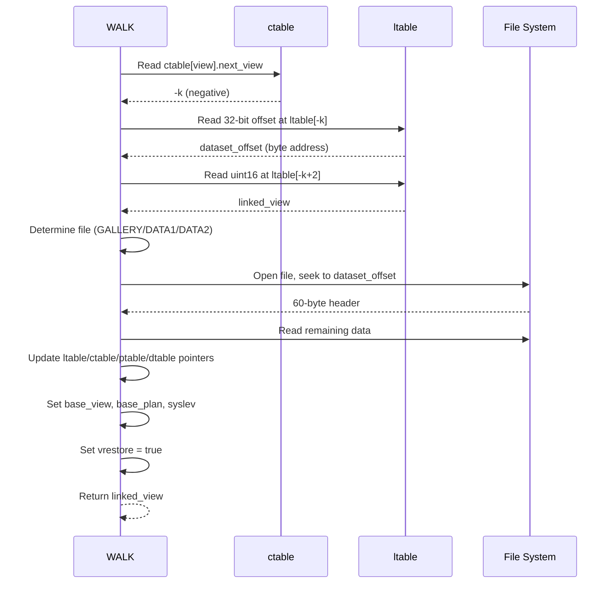

# Movement Primitives and Cross-Dataset Navigation

## The Four Movement Operations

All movement in the surrogate walk is built from two primitives: `rightof/leftof` (turning) and `nextview` (stepping forward). The four user-facing actions are:

### Forward (`g.nw.goforward`)

```bcpl
let next = nextview.(g.nw!view)
test next = 0 then error.() or moveto.(next)
```

Simply reads the forward view from the control table and moves to it.

### Back (`g.nw.goback`)

```bcpl
let next = nextview.(opposite.(g.nw!view))
test next = 0 then error.() or moveto.(opposite.(next))
```

Turn 180°, step forward, then turn 180° again. This means "walk back" in 3D space while maintaining the original facing direction.

### Right (`g.nw.goright`)

```bcpl
let next = nextview.(rightof.(rightof.(g.nw!view)))
test next = 0 then error.() or moveto.(leftof.(leftof.(next)))
```

Turn 90° right, step forward, then turn 90° left. The net effect: move laterally to the right without changing the facing direction.

### Left (`g.nw.goleft`)

```bcpl
let next = nextview.(leftof.(leftof.(g.nw!view)))
test next = 0 then error.() or moveto.(rightof.(rightof.(next)))
```

Turn 90° left, step forward, then turn 90° right. Move laterally to the left.

### Summary Table

| Action | Steps |
|--------|-------|
| Forward | `nextview(v)` |
| Back | `opposite → nextview → opposite` |
| Right | `rightof×2 → nextview → leftof×2` |
| Left | `leftof×2 → nextview → rightof×2` |
| Turn Right | `rightof(v)` (no movement, just turn) |
| Turn Left | `leftof(v)` (no movement, just turn) |



## The `nextview` Function

`nextview(view)` is the core forward-step primitive. It handles both same-dataset and cross-dataset navigation:

```bcpl
and nextview.(view) = valof
$(  let next = r(g.nw!ctable+2*view)
    if next >= 0 resultis next   // 0 = dead-end, >0 = same-dataset view
    view := r(g.nw!ltable-next+2)  // next view in linked dataset
    $(  let v = vec 1
        g.ut.unpack32(g.nw,(g.nw!ltable-next)*2,v) // 32-bit dataset offset
        readdataset.(v)
    $)
    G.nw!base.pos := (view - 1) / 8 * 2  // update plan position tracking
    resultis view
$)
```

## Cross-Dataset Navigation

When `ctable[v].next_view < 0`, the forward step crosses a dataset boundary. The process:



### File Selection Logic

```bcpl
p := g.dh.open(
    ingallery.() -> "GALLERY",
    (high & #X8000) ~= 0 -> "DATA2",
    "DATA1"
)
```

| Condition | File |
|-----------|------|
| `ingallery()` = true | GALLERY |
| high word bit 15 set | DATA2 |
| otherwise | DATA1 |

### `ingallery()` Determination

```bcpl
and ingallery.() = valof
$(  let s = g.context!m.state
    if s = m.st.gallery | s = m.st.galmove |
       s = m.st.gplan1  | s = m.st.gplan2 |
       s = m.st.detail  & g.nw!gallerydetail resultis true
    resultis false
$)
```

The `gallerydetail` flag distinguishes between a detail viewed from the gallery versus a detail in a walk, since both use the same `m.st.detail` state.

## Dead-end Detection

Before drawing the menu bar, WALK checks which directions are navigable:

```bcpl
if deadend.(p)                    do v!3 := m.sd.wblank  // Forward grayed
if deadend.(opposite.(p))         do v!4 := m.sd.wblank  // Back grayed
if deadend.(leftof.(leftof.(p)))  do v!2 := m.sd.wblank  // <Move grayed
if deadend.(rightof.(rightof.(p))) do v!5 := m.sd.wblank // >Move grayed
```

`deadend.(view)` is true when `ctable[view].next_view = 0`.

## Close-up Chain (Walk Detail Mode)

In walk mode, clicking a magnifying glass icon enters a close-up chain — a sequence of detailed images stored as frame offsets in the dtable.

```bcpl
g.nw!cubase := g.nw!dtable + r(o+2)  // point to chain base in dtable
g.nw!cu     := 1                      // start at first frame
G.nw.showframe.(g.nw!m.baseview + r(g.nw!cubase + g.nw!cu))
```

The chain structure in dtable:
- Word 0: count of frames in the chain
- Words 1..n: frame offsets from `base_view`

Navigation in close-up:
- `FKey7` (or left third of screen): previous frame (`cu--`)
- `FKey8` (or right third of screen): next frame (`cu++`)
- Count is checked at both ends to prevent overrun.

## `moveto` Side Effects

When `moveto.(nextview)` is called, it:
1. Updates `g.nw!view`
2. Sets `g.nw!fiddlemenu := true` (menu bar needs redraw)
3. Calls `clear.()` to erase any drawn content
4. Shows the frame: `G.nw.showframe.(base_view + nextview)`
5. In walk mode (syslev ≠ 1): draws detail icon(s) from dtable for that view
