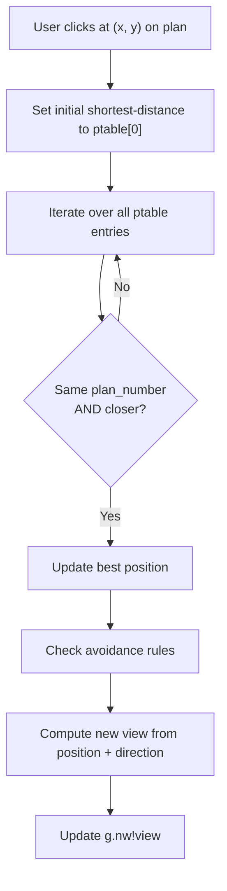
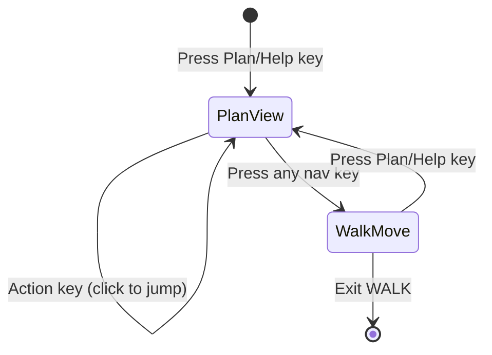

# Plan Map Navigation

The plan view shows an overhead map image of the current walk environment with a directional arrow indicating the user's current position and facing direction. The user can click on the plan to jump to a nearby location, or use the change key to rotate their direction.

## Initialisation (`g.nw.init2`)

From `walk2.b`:

```bcpl
and g.nw.init2() be
$(  let position = (g.nw!view-1)/8*2
    let x = ru(g.nw!ptable + position + 1)
    let y = ru(g.nw!ptable + position)
    plan      := y >> 12                             // plan image number (bits 12–15)
    direction := (8 - (x >> 12) + g.nw!view) rem 8  // current bearing
    G.nw.showframe.(g.nw!m.baseplan + g.nw!m.baseview + plan)
    arrow.(x & #XFFF, y & #XFFF, direction)
$)
```

Steps:
1. Compute the plan table word index for the current view group.
2. Read the packed x_word and y_word from the plan table.
3. Extract `plan_number` (y_word bits 12–15) and coordinates (bits 0–11).
4. Calculate the compass direction from `base_direction` (x_word bits 12–15) and current view.
5. Display the plan frame and draw the directional arrow.

## Plan Frame Number

```
plan_frame = base_plan + base_view + plan_number
```

Where `plan_number` is bits 12–15 of the ptable y_word (0–15).

## Arrow Drawing (`arrow`)

The arrow is drawn using BCPL's screen primitives. Direction 0 is North (up), increasing clockwise:

```bcpl
and arrow.(x, y, dir) be
$(  let cosa = dir ! table 10, 7, 0, -7,-10, -7, 0, 7
    let sina = dir ! table  0, 7,10,  7,  0, -7,-10,-7
    g.sc.movea(m.sd.display, x-cosa-7*sina, y+sina-7*cosa)
    g.sc.parallel(m.sd.plot, 5*sina, 5*cosa, 2*cosa, -2*sina)  // arrow shaft
    g.sc.movea(m.sd.display, x+3*sina, y+3*cosa)
    g.sc.triangle(m.sd.plot, 3*cosa-5*sina, -3*sina-5*cosa, -6*cosa, 6*sina)  // arrowhead
$)
```

## Rotating Direction (Change Key)

When the user presses the Change key while the mouse is in the display area:

```bcpl
direction := (direction + 1) rem 8
north := ru(G.nw!ptable + position + 1)
new.dir := (((north >> 12) rem 8) + direction) rem 8  // new view within group
if new.dir = 0 new.dir := 8
G.nw!view := (position / 2 * 8) + new.dir
```

1. Increment compass direction (mod 8).
2. From the plan table `base_direction` and new compass direction, compute the new view number within the current group.
3. Update `g.nw!view` to the calculated view.
4. Redraw the arrow at the same location with the new direction.

## Clicking to Navigate (Action Key)

When the user clicks in the display area with the Action key:



### Squared Distance Calculation

```bcpl
a := (ru(G.nw!ptable + i + 1) & #xFFF) - x   // ΔX
b := (ru(G.nw!ptable + i) & #xFFF) - y        // ΔY
dis.sq(a, b, len1.sq)                           // a² + b²
```

`dis.sq` computes the sum of squares using 32-bit integer arithmetic (since coordinates are 0–4095, the maximum square is 4095² = 16,769,025, fitting in 32 bits).

### Avoidance Rules

To prevent the user from jumping backwards along the path:

```bcpl
unless G.nw!m.syslev = 1 & ingallery.() then
    test ingallery.() & G.nw!m.syslev ~= 1 then
        if position = G.nw!base.pos - 2 then
           position := G.nw!base.pos + 4   // skip one group behind
    else if position = G.nw!base.pos then
        position := G.nw!base.pos + 4      // skip backward entry
```

`base.pos` stores the plan table word position at the time the current walk dataset was entered, preventing the user from navigating back to the entry point of the walk.

### View Calculation from Position

```bcpl
x   := ru(G.nw!ptable + position + 1)        // x_word for new position
y   := (((x >> 12) rem 8) + direction) rem 8  // new view offset within group
if y = 0 y := 8
G.nw!view := (position / 2 * 8) + y          // absolute view number
```

## Plan Navigation State Machine



The plan states are:
- `m.st.gplan1` / `m.st.gplan2` — plan view from gallery
- `m.st.wplan1` / `m.st.wplan2` — plan view from walk

The split into plan1/plan2 states accommodates the two-pass rendering of the plan (frame display and overlay drawing).
