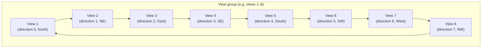
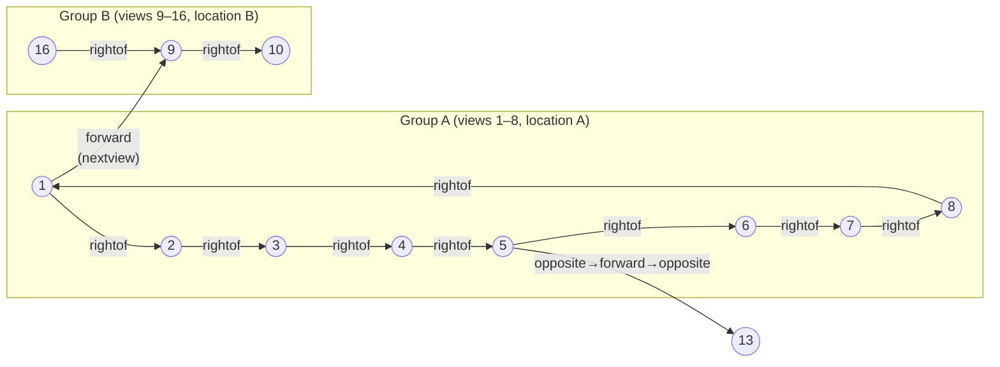

# View Model and Position Arithmetic

## The 8-Direction Compass System

Each physical location in a surrogate walk is photographed from 8 compass directions, 45° apart. Views are numbered sequentially in groups of 8, starting at 1.

```
Views 1–8:   location A (8 directions)
Views 9–16:  location B (8 directions)
Views 17–24: location C (8 directions)
...
```

Within each group, direction increases by 45° per step:



## Turning Primitives

Defined in `walk1.b` and documented in `nwhd.h`.

### `rightof(view)` — Turn 45° clockwise

```bcpl
rightof.(view) = (view & 7) = 0 -> view-7, view+1
```

| Condition | Formula | Effect |
|-----------|---------|--------|
| `view mod 8 = 0` (last in group) | `view − 7` | Wrap back to start of same group |
| otherwise | `view + 1` | Next view in group |

**Examples**: `rightof(8) = 1`, `rightof(16) = 9`, `rightof(3) = 4`

### `leftof(view)` — Turn 45° counter-clockwise

```bcpl
leftof.(view) = (view & 7) = 1 -> view+7, view-1
```

| Condition | Formula | Effect |
|-----------|---------|--------|
| `view mod 8 = 1` (first in group) | `view + 7` | Wrap to end of same group |
| otherwise | `view − 1` | Previous view in group |

**Examples**: `leftof(1) = 8`, `leftof(9) = 16`, `leftof(3) = 2`

### `opposite(view)` — Turn 180°

Implemented as four consecutive `leftof` calls:
```bcpl
opposite.(view) = leftof.(leftof.(leftof.(leftof.(view))))
```

This is equivalent to adding 4 within the 8-element cycle.

## Compass Direction Formula

The compass bearing of view `v` on the plan map is calculated from the `base_direction` stored in the plan table x_word bits 12–15:

```
direction = (8 − base_direction + v) mod 8
angle     = direction × 45°
```

From `walk2.b`:
```bcpl
direction := (8 - (x >> 12) + g.nw!view) rem 8
```

The `base_direction` stored in the ptable is the base for the view group; adding the 0-based position of `view` within its group (derived from `v mod 8 − 1`) gives the actual bearing.

## Plan Position

Each group of 8 views shares a single (X, Y) coordinate on the plan image. The position is read from the plan table using:

```
position = ((view − 1) / 8) × 2     (integer division)
```

This gives the word index into the plan table for that group's record.

### Direction Arrow

The compass arrow drawn on the plan image uses a lookup table of sine/cosine pairs (scaled to integer) for each of the 8 directions:

```bcpl
let cosa = dir ! table 10,  7,  0, -7,-10, -7,  0,  7
let sina = dir ! table  0,  7, 10,  7,  0, -7,-10, -7
```

| Direction | cosa | sina | Degrees |
|-----------|------|------|---------|
| 0 (N) | 10 | 0 | 0° |
| 1 (NE) | 7 | 7 | 45° |
| 2 (E) | 0 | 10 | 90° |
| 3 (SE) | −7 | 7 | 135° |
| 4 (S) | −10 | 0 | 180° |
| 5 (SW) | −7 | −7 | 225° |
| 6 (W) | 0 | −10 | 270° |
| 7 (NW) | 7 | −7 | 315° |

## Frame Number Calculation

Given a view `v` and the dataset's `base_view`:
```
frame = base_view + v
```

Given a plan number `p` and the dataset's `base_view` and `base_plan`:
```
plan_frame = base_plan + base_view + p
```

From `walk2.b`:
```bcpl
G.nw.showframe.(g.nw!m.baseplan + g.nw!m.baseview + plan)
```

## View Group Diagram


